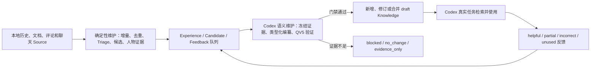

# Codex 接入与持续知识维护

## 当前结论

IKB 已能被本机 Codex 直接使用，并具备持续维护入口：

- Codex 在编码、评审、CR、写文档、规划和工作沟通等实质任务中，默认先检索 IKB，生成 Context Pack，再结合当前代码、文档和运行时事实工作。
- 本地确定性维护持续接入新来源、去重、筛选 Experience、发现候选、重建人物证据、巡检现有知识和生成观测报告。
- Codex 每日语义维护只消费已经落入 IKB 的本地证据，按 QV5 编纂、保真检查和生命周期规则处理至多 3 个主题。
- 证据不足会明确得到 `blocked` 或 `no_change`，不会为了增加数量而制造或覆盖知识。
- 整套链路不依赖 Opik，IKB 的 Ledger、Artifact、Verifier 和本地报表是事实源。

“可以用”不表示所有历史 Source 已经分析完。当前 41 条现役 Work Knowledge 已完成 QV5 收口；来源候选仍有存量积压，后续由限频采集和每日语义维护持续消化。

## 系统怎样运行



这条循环有三个明确边界：

1. Source 是原始证据，不会因生成知识被删除。
2. 语义维护不能自动把知识升级为 `verified` 或 `user_confirmed`。
3. 只有真实任务使用后才能记录使用反馈；检索成功或维护成功不能伪造 `helpful`。

## Codex 接入点

### 默认使用

用户级指令位于 `/Users/htwu/.codex/AGENTS.md`。它要求 Codex 在有实际交付物的任务中使用 `$ikb-use-knowledge`，同时规定：

- `draft / source_confirmed` 只能作为有来源的建议；
- 当前代码、线上事实、用户指令和负责人最新确认优先；
- 人物知识只能辅助准备沟通和协作，禁止用于人格、动机、能力等级、绩效、晋升或组织权力推断。

用户不需要每次手工执行 CLI。正常提出编码、评审、文档或沟通任务即可。需要显式触发时，可以直接说：

```text
使用 $ikb-use-knowledge，先检索 IKB，再完成这次评审。
```

### Skills

IKB Skills 通过 Codex 官方用户目录 `/Users/htwu/.agents/skills/` 接入，实际内容仍由本仓统一维护：

- `ikb-source-intake`：接入和保存来源；
- `ikb-conversation-analysis`：分析会话、人物证据和重要评论；
- `ikb-knowledge-curator`：按知识类型编纂；
- `ikb-verification`：执行 QV5 及信息损耗门禁；
- `ikb-use-knowledge`：在真实任务中检索、使用和反馈；
- `ikb-maintain-knowledge`：执行有限主题的每日语义维护。

## 两类持续任务

### 确定性维护

本机 LaunchAgent `com.htwu.ikb.maintenance` 每 6 小时执行一次 daily 维护；`com.htwu.ikb.maintenance-weekly` 每周一 03:30 执行 weekly 维护。详细步骤见[维护运行契约](./维护运行契约.md)。

它负责确定性工作：本地增量导入、原始去重、Session Triage、候选发现和解析、人物证据重建、知识索引、lint、doctor、ledger、8 Case Harness 评估和报表。

学城读取仍遵守 Core 的全局硬限制：30 分钟最多 10 篇、单次请求至少间隔 30 秒；写操作不在维护链内。语义维护本身完全不访问学城、大象或网络。

### Codex 每日语义维护

Codex Automation：`IKB 每日语义维护`，ID 为 `ikb`，每天 10:30 在本机运行。

每次只从本地 IKB 选择至多 3 个主题，优先级依次为：

1. `incorrect`、`partial` 使用反馈；
2. 人工纠偏、Verifier 驳回、冲突和过期；
3. 到达 readiness 的人物证据；
4. 有独立 Episode 或真实验证的高优先级 Experience；
5. 能回答明确工作问题的新 Source。

每个主题都必须冻结证据并通过完整 QV5。人物默认只生成 evidence-only dossier；人物用途扩展、既有 verified 知识、高风险结论只生成完整评审包，不自动替用户决定。

## 怎样观察和处理问题

本地观测页由 `com.htwu.ikb.report` 常驻提供：

- 入口：`http://127.0.0.1:3417`
- 日常概览：`./bin/ikb observe daily --json`
- Task 时间线：`./bin/ikb timeline <task-id> --json`
- Run 详情：`./bin/ikb run show <run-id> --json`
- 系统健康：先执行 `doctor --write-summary` 和 `ledger verify --write-summary`，再读取 `health`。

观测时应区分三件事：

- `Run succeeded`：流程执行结束；
- Verifier 和 QV5 通过：本次知识编纂符合门禁；
- 真实任务反馈：知识在实际工作中是否有用。

如果需要人确认，系统必须给出完整稿、原始证据链接、推荐选项和影响，不能只给 ID 或状态。没有待确认事项时，不打扰用户。

## 真实 canary 结果

### 知识使用成功

从非 IKB 仓库启动全新的 Codex 进程，使用 `$ikb-use-knowledge` 完成一次真实评审任务：

- Task：`task-6f018591-74a`
- Run：`run-4a598514-b58`
- Context Pack：`artifact-7ff62588-8e2`
- 最终评审稿：`artifact-2a47fc8b-dfe`
- Run 质量：`artifact-3d938a30-0ab`，8/8 通过

最终稿实际使用了 5 条 QV5 Knowledge，并把它们限定为评审指导，没有误写成当前实现事实。

### 语义维护安全阻断

全新的 Codex 进程使用 `$ikb-maintain-knowledge` 处理一个真实 `partial` 反馈：

- Task：`task-217bfe38-0e1`
- Run：`run-be3f0efc-72c`
- 主题：`kb-edbee761-caa`，机票报价模型统一业务事实包
- 结果：`blocked`

该旧知识缺少可重放 Source、事实引用、时间状态和完整 QV5 编译链。消费者产物只能证明“历史背景有帮助、当前状态缺失”，不能证明当前报价迁移状态。维护任务因此保留原卡、不覆盖、不升级，并留下了补证入口。这是正确的安全结果，不是流程故障。

## 当前无需用户决定的事项

系统现在可以直接持续运行，不需要用户先批准某条知识。`kb-edbee761-caa` 只有在后续任务确实需要当前报价迁移状态时，才需要补充当前代码、IDL、真实订单或运行时证据；在此之前保持历史建议状态更可靠。

后续若出现待确认知识，Codex Automation 会产出讲人话的评审包，而不是直接改变 verified 知识或人物结论。
