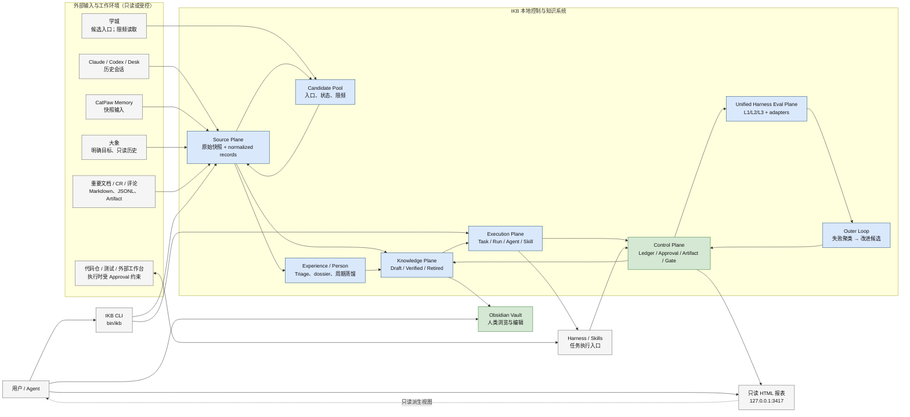
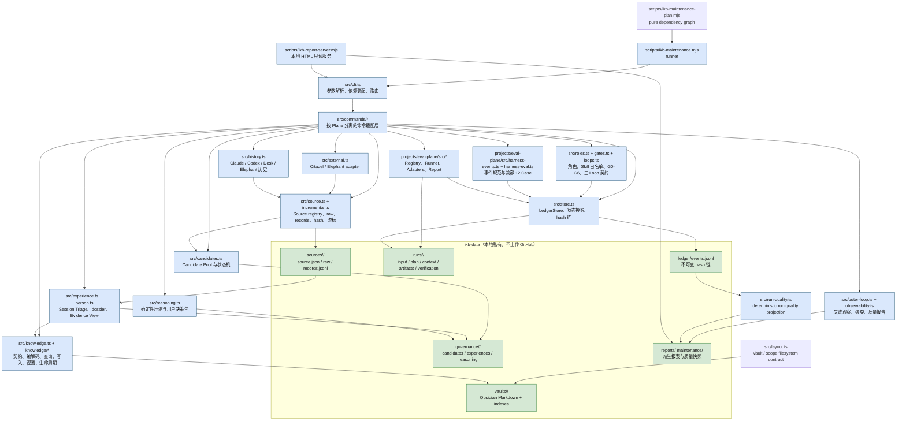
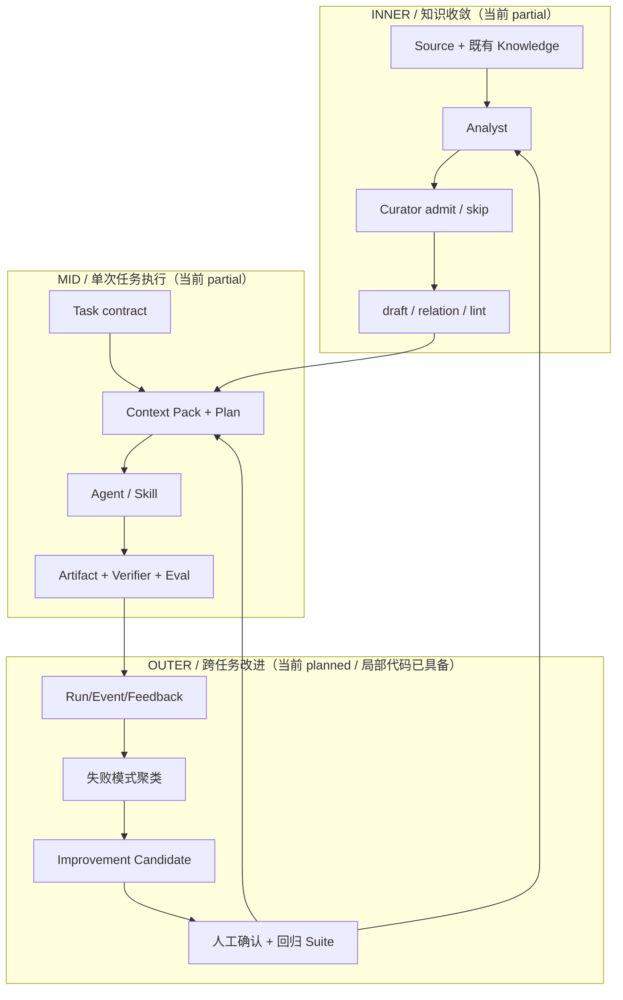
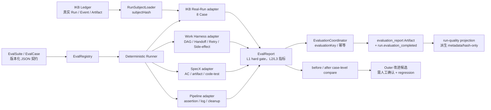
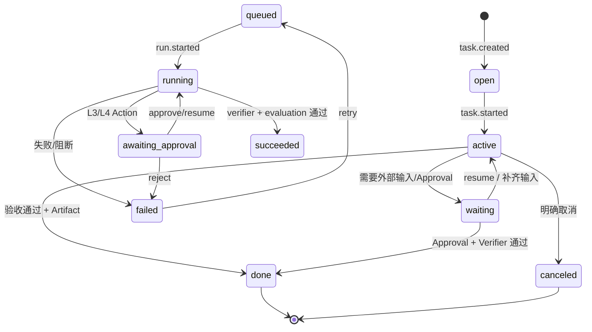

# IKB 当前架构设计图（v0.1）

> 重绘日期：2026-07-22
> 范围：`/Users/htwu/projects/ikb` 当前代码、公开设计文档和本地 `ikb-data` 的状态。
> 约束：本次只读本地数据，没有触发学城读取；学城入口仍受“滚动 30 分钟最多 10 篇”保护。

## 1. 这张图回答什么问题

IKB 不是“把所有聊天丢进 Obsidian”的文件夹，而是一个本地优先的个人知识工作系统：

```text
外部材料/历史对话
  → Source 证据
  → Candidate / Experience 分流
  → 分析 Artifact
  → Knowledge draft / skip
  → Context Pack
  → Task / Run / Agent / Skill 执行
  → Verifier / Eval / Approval
  → 可追溯结果
  → Outer Loop 改进候选
```

核心原则：

1. `Ledger` 是 Task、Run、Approval、Artifact 和结构化事件的真相源。
2. `Source` 是原始证据真相源；`Knowledge` 不是聊天原文的替身。
3. 本地质量投影和 HTML 报表只能展示 Ledger 的派生视图，不能反向决定质量。
4. `admit` 和 `skip` 都是正常结果；知识条数不是产出指标。
5. 外部读取默认只读，任何发送、评论、发布、push 等副作用必须经过 Approval。

## 2. 当前本地状态快照

命令：`./bin/ikb candidate list --scope work --json`。本次没有读取学城，只读取候选池和 Ledger。

| 对象 | 当前值 | 含义 |
|---|---:|---|
| Citadel `discovered` | 1408 | 已发现入口但尚未读取的学城候选 |
| Citadel `ingested` | 394 | 已产生正文/评论 Source 的候选 |
| `blocked` | 56 | 权限、密级、可用性或读取失败，保留原因等待重试 |
| `rejected` | 8 | 明确不再处理的候选 |
| Work Candidate 总数 | 1866 | 当前 work scope 候选池总量 |
| Source | 1390 | 所有来源快照/标准化记录 |
| Ledger events | 8997 | 可校验事件数量 |
| Knowledge lint | 通过 | 当前 work Vault 无质量问题 |

`discovered=1408` 说明“还有不少没读”，但它不等价于“必须全部读取”。后续应由候选优先级、限频窗口、权限和分析价值决定读取顺序。

## 3. L0：系统上下文图



### L0 边界

- 公开仓库保存代码、契约、合成 fixtures 和设计文档；真实 Source、工作 Knowledge、人物档案、运行产物留在本地 `ikb-data/`。
- 外部系统仍是对应业务对象的真相源；IKB 保存来源定位、快照 hash、引用和执行证据。
- `Obsidian` 是 Knowledge 的人类工作台，不是 Task/Run 状态机。
- HTML 报表和本地质量投影都是观察面，不允许绕过 Ledger 写状态。

## 4. L1：代码容器与数据容器图



### 4.1 真相源与派生视图

| 层 | 真相源 | 允许写入 | 可重建视图 |
|---|---|---|---|
| Source | `ikb-data/sources/<id>` + `source.*` 事件 | intake / connector | context、人物 evidence、候选发现 |
| Candidate | `governance/<scope>/candidates/pool.jsonl` + candidate 事件 | discover、queue、resolve、skip | 候选列表、限频状态 |
| Knowledge | `vaults/<scope>/<collection>/*.md` + knowledge 事件 | Curator draft、Verifier/用户确认 | index、搜索、Obsidian backlink |
| Experience | `governance/<scope>/experiences/` | Triage、跨 Run cluster | pending_review 候选 |
| Task/Run | `ledger/events.jsonl` | CLI/Harness/Verifier/Approval | timeline、status、report |
| Artifact | `runs/<run>/artifacts/` + artifact 事件 | Agent/Verifier | digest、报告、质量引用 |
| 本地质量投影 | `src/run-quality.ts` + `reports/` | HTML/日报/评估 | 质量快照，不反写 IKB |

## 5. Source → Knowledge → Work 详细闭环

```mermaid
flowchart LR
    A["Source 输入\n聊天 / 文档 / 评论 / 运行产物"] --> B["原始快照\nraw hash + records hash"]
    B --> C["增量与完整性\nlogical key + cursor + doctor"]
    C --> D{ "是否存在明确外部入口？" }
    D -- "是" --> E["Candidate Pool\ndiscovered / queued / blocked"]
    E --> F["Citadel 只读解析\n30 分钟最多 10 篇"]
    D -- "否" --> G["Source Context\n按记录引用阅读"]
    F --> G
    G --> H["Session Triage / Person Dossier\n只保存信号与引用"]
    G --> I["Analyst Artifact\nfindings / unknowns / conflicts"]
    H --> I
    I --> J{ "长期可复用且证据充分？" }
    J -- "skip" --> K["Rejected Candidate\n保留理由，不生成知识"]
    J -- "admit" --> L["Knowledge Card draft\n适用、边界、使用契约、验证计划"]
    L --> M["lint + doctor + relation rebuild"]
    M --> N{ "真实 Task / 用户确认？" }
    N -- "否" --> O["draft\n可引用但不当作已验证事实"]
    N -- "是" --> P["verified\n仍保留 Source refs"]
    O --> Q["Context Pack\n按任务、scope、敏感度检索"]
    P --> Q
    Q --> R["Task → Run\n角色 / Skill / plan / checkpoint"]
    R --> S["Artifact + Gate + Verifier"]
    S --> T{ "外部副作用？" }
    T -- "是" --> U["Approval\n目标/载荷 hash 匹配"]
    T -- "否" --> V["完成或阻断"]
    U --> V
    V --> W["Evaluation + Observability\nL1 hard gate / L2-L3 report"]
    W --> X["Feedback / Outer candidate\n人工确认后才改 Skill/Knowledge"]
    X --> I
```

### 分流规则

- `Source` 只回答“发生了什么、来自哪里”；不自动变成知识。
- `Experience` 只回答“流程哪里重复失败或发生纠偏”；不直接变成知识。
- `Knowledge` 必须能改变未来判断或行动，且可回到 Source/Artifact。
- 人物知识额外要求身份置信度、独立 Episode、时间有效性和可行动性；不能从单条发言推断人格。
- `skip` 也写事件和 rejected Candidate，保证以后能解释“为什么没记”。

## 6. 三层 Harness Loop



| Loop | 所有者 | 输入重点 | 输出重点 | 当前边界 |
|---|---|---|---|---|
| Inner | `ikb-harness` + intake/analyst/curator/verifier | Source、分析问题、scope、已有知识 | Analysis Artifact、draft/skip、gate | CLI/契约/门禁可用；自动节点编排仍是 partial |
| Mid | `ikb-harness` + operator/verifier | Task、Context Pack、Plan、Approval | Run、Artifact、Verifier、Evaluation | Ledger/事件/Eval 已有；通用自动执行 runtime 仍非完整 |
| Outer | `ikb-harness` + analyst/verifier | 多 Run、失败、反馈、知识使用 | pattern / improvement candidate | 聚类和候选已实现；自动修改 Skill/权限/Prompt 禁止 |

## 7. Unified Harness Eval Plane



当前注册的 Suite：

| Suite | Kind | Level | Case 数 | 适配器 | 作用 |
|---|---|---|---:|---|---|
| `ikb-admission-knowledge` | regression | L1 | 4 | IKB | admit/skip、证据、scope |
| `ikb-mid-run-quality` | regression | L1 | 2 | IKB | terminal success 不等于质量 |
| `ikb-approval-recovery-security` | regression | L1 | 5 | IKB | Approval、幂等、副作用、隔离 |
| `ikb-outer-loop` | regression | L2 | 1 | IKB | 重复失败候选 |
| `work-protocol` | regression | L1/L2 | 9 | Work Harness | DAG、Handoff、Verifier、Retry、指标 |
| `specx-ac` | regression | L3 | 1 | SpecX | AC、artifact 新鲜度、代码/测试一致性 |
| `pipeline-contract` | regression | L3 | 1 | Pipeline | 执行、断言、日志验证、清理幂等 |
| `ikb-run-quality` | run_assessment | L1/L2/L3 | 8 | IKB Run | 真实质量链、DAG、Handoff、Approval、幂等、恢复 |
| `work-run-quality` | run_assessment | L1/L2/L3 | 7 | Work Harness Run | task-dir 合同、DAG/范围、Handoff、Verifier、重试、恢复 |

评估不是总分：L1 作为硬门禁，L2/L3 只做报告与版本比较；LLM Judge 目前只是扩展接口，不作为硬门禁。

## 8. 控制面状态与副作用边界



### 副作用分层

| 级别 | 例子 | 当前处理 |
|---|---|---|
| L0 | 本地只读查询、分析、生成报告 | 可自动执行，必须留 Artifact/事件 |
| L1 | 本地私有 Source/Vault draft | 受 scope、lint、doctor 约束 |
| L2 | 工作区代码/文档草稿、测试运行 | 受 Task、Run、Verifier 约束 |
| L3 | CR 评论、ONES 更新、外部草稿发送 | 必须 Approval，目标/载荷 hash 匹配 |
| L4 | 大象发送、发布、不可逆外部动作 | 当前不自动执行，必须人工确认 |

## 9. 重绘后的实现缺口

这张图也标出“已经画出但还没有伪装成完成”的部分：

1. 学城候选池目前还有 1408 个 `discovered`，后续只能在用户允许的窗口内按优先级读取。
2. Inner/Mid 的 Ledger、事件、Verifier 和真实 Run Assessment 已接通；通用角色自动交接和恢复编排仍是 partial。
3. Outer 的失败观察、聚类和候选已存在；自动修改 Prompt、Skill、权限、角色和门禁明确禁止。
4. 本地报告可以展示运行过程和评估结果，但只有 IKB 本地 Source/Artifact 才能判断内容正确性。
5. 人物 dossier 是可重建证据视图，不是把每条消息直接叠加成画像；人物 Knowledge 仍需周期蒸馏和置信度门禁。

## 10. 使用入口

```bash
# 本地架构/状态核对
./bin/ikb doctor --json
./bin/ikb ledger verify --json
./bin/ikb candidate list --scope work --json

# 查看角色、Loop 和门禁
./bin/ikb agent list --json
./bin/ikb loop list --json
./bin/ikb gate list --json

# Harness Eval
./bin/ikb harness suite list --json
./bin/ikb harness eval --suite work-protocol --json
./bin/ikb harness report --suite work-protocol
./bin/ikb run evaluate <run-id> --suite ikb-run-quality --json
./bin/ikb harness report --suite ikb-run-quality --run <run-id> --json
./bin/ikb harness eval --suite work-run-quality --task-dir .agent-work/<task-id> --json
./bin/ikb harness report --suite work-run-quality --task-dir .agent-work/<task-id> --json

# 只读 HTML 观测
node scripts/ikb-report-server.mjs --port 3417
```

本图是当前实现的设计基线，不是未来架构承诺。新增数据源、状态或外部副作用时，应先更新本图对应的契约、真相源和门禁，再实现代码。
