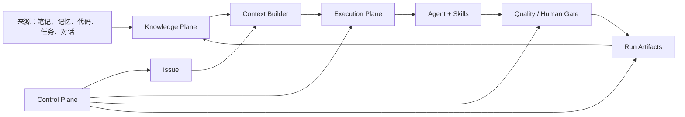

# individualKB 产品与架构方案

## 核心判断

个人知识库的价值不在“记了多少”，在“下一次工作能不能拿到正确上下文，并用结果修正原来的认知”。系统必须同时管知识和工作，但两者不能混成一个目录：知识描述什么长期成立，Issue 描述当前要完成什么，Run 记录这次实际发生了什么。

individualKB 因此分成三个平面：Knowledge Plane 保存长期事实、决策、偏好和方法；Execution Plane 用 Agent、Skill 和 Harness 执行工作；Control Plane 用 Multica 式界面管理 Issue、Run、门禁和产物。

## 产品边界

### 要解决的问题

当前能力分散在 CatPaw Memory、Obsidian、Skills、SpecX、代码仓和任务平台中。Agent 能做单项工作，但经常缺少历史背景；记忆能提供最近上下文，却不适合承载正式知识；任务平台能展示状态，但不知道为什么这样决策。

individualKB 把它们接成一条闭环：

```text
记录来源
  → 提取候选知识
  → 验证与准入
  → 任务检索引用
  → Agent/Skill 执行
  → 结果验证
  → 更新知识与工作方法
```

首批覆盖六类高频工作：编码、评审、CR、写文档、大象沟通和向上管理。生活侧先提供个人项目、人物、偏好、决策和复盘能力，不在第一版接支付、家庭设备或高风险自动化。

### 不解决的问题

- 不替代 Obsidian 的编辑体验，也不依赖 Obsidian 才能运行。
- 不替代 GitHub、ONES 或代码评审平台；控制面保存索引和执行证据，外部系统仍是对应业务对象的真相源。
- 不把所有聊天、日志和文件都升级为知识。
- 不在第一版建设多租户 SaaS、通用向量平台或完整知识图谱。
- 不允许 Agent 绕过权限策略直接执行外部副作用。

## 三个平面



### Knowledge Plane

Knowledge Plane 只保存未来会改变判断或行动的内容。原始日志、聊天全文和临时过程不会直接进入正式知识。

知识类型控制在六类：

| 类型 | 解决的问题 | 示例 |
|---|---|---|
| fact | 当前什么是真的 | 服务边界、接口约束、某人的职责 |
| decision | 为什么做过某个选择 | 选本地优先而不是云端优先 |
| preference | 如何更适合用户 | 写作风格、沟通偏好、工具偏好 |
| playbook | 某类事情怎么做 | CR 流程、告警排查、周报生成 |
| entity | 重要对象是谁或是什么 | 人、项目、系统、组织 |
| goal | 当前追求什么结果 | 季度目标、个人计划、项目里程碑 |

知识生命周期只保留 `draft / verified / retired`。draft 表示候选知识，verified 表示有来源且被任务验证过，retired 表示不再作为当前事实使用。冲突、过期、权限不足属于检测结果或数据源状态，不扩充知识状态。

每条知识至少包含：稳定 ID、类型、工作/生活范围、敏感等级、来源引用、有效时间、复核时间和标签。frontmatter 使用扁平字段，正文存放判断、适用边界和证据。

### Execution Plane

Execution Plane 把一项工作表示成 Issue，把一次尝试表示成 Run。Issue 可以经历多次 Run；失败不会抹掉历史，新的 Run 从上一次的产物和反馈恢复。

执行链路固定为：

```text
Issue 创建
  → 目标与验收检查
  → 风险分级
  → 组装 context pack
  → 生成计划
  → 调用 Agent / Skill
  → 确定性质量检查
  → 人工门禁或自动完成
  → 记录产物与验证结果
  → 知识回写候选
```

Framework 负责顺序、状态、重试、门禁、恢复点和日志格式；Agent 负责分类、检索意图、方案判断、写作和异常处置建议。固定流程不写进 prompt，语义判断不硬编码进状态机。

### Control Plane

控制面借鉴 Multica 的交互，但不是复制一个看板。核心对象关系是：

```text
Issue
  ├─ assigned Agent
  ├─ enabled Skills
  ├─ Knowledge References
  ├─ Run 1
  │   ├─ Context Pack
  │   ├─ Steps / Events
  │   ├─ Gate
  │   └─ Artifacts
  └─ Run 2
      └─ 从 Run 1 的反馈恢复
```

首版界面包含：

- Today：进行中 Issue、待人工处理 Gate、今日计划和最近失败。
- Issues：列表、看板、筛选、优先级、负责人和状态。
- Issue Detail：目标、验收、上下文引用、Run 时间线、产物和决策。
- Runs：运行日志、步骤耗时、重试、失败原因和恢复入口。
- Knowledge：候选、待澄清、待复核、引用次数和来源覆盖。
- Agents / Skills：能力目录、输入输出、副作用、最近成功率。
- Reviews：周度复盘、Harness 改进建议和待审批补丁。

## 数据分区与存储

### 逻辑统一，物理隔离

真实知识不直接放进公开仓库。推荐三类目录：

```text
individualKB/                 # 公开代码、模板、脱敏示例
~/Knowledge/personal-vault/   # 个人知识，私有 Git 或本地备份
~/Knowledge/work-vault/       # 工作知识，本地或公司批准的内部存储
```

搜索层可以跨两个 Vault 联合检索，但返回结果必须保留 scope 和 sensitivity；工作知识不得被个人工作流导出到公开目标。

### 各类数据的真相源

| 数据 | 真相源 | 派生数据 |
|---|---|---|
| 长期知识 | Markdown + Git | FTS、Embedding、关系索引 |
| Issue / Run / Gate | SQLite 事件与状态表 | 看板聚合、统计报表 |
| 大型运行日志与附件 | 本地运行目录/对象存储 | change digest、检索摘要 |
| Agent / Skill / Workflow | 版本化 manifest | UI 能力目录、运行计划 |
| Token / Cookie / 密钥 | 系统密钥设施 | 知识库只保存引用名，不保存值 |

SQLite 和向量索引都必须可删除重建。Markdown 不承担高频运行状态，避免 Obsidian 编辑和任务引擎相互覆盖。

## 技术形态

第一版采用本地优先的 TypeScript monorepo：

```text
apps/
  console/        # React 控制面
  server/         # 本地 API 与任务调度
packages/
  contracts/      # Knowledge / Issue / Run / Agent / Skill schema
  knowledge/      # Vault、索引、检索、引用与准入
  harness/        # 工作流、门禁、恢复与可观测性
  adapters/       # Agent runtime、Obsidian、Git、外部工具适配
  cli/            # ikb 命令行
examples/
  demo-vault/     # 可公开的脱敏示例
```

本地服务负责访问 Vault、Git 和 Agent runtime；Web 控制面只通过 API 操作，不直接读写文件。后续若需要远程查看任务，可增加私有远端控制面和本地 daemon，同步 Issue 元数据与运行摘要，不上传敏感知识正文。

## 与现有系统的关系

| 现有能力 | 在 individualKB 中的定位 | 复用方式 |
|---|---|---|
| CatPaw Memory | 热记忆 | 定期抽取候选知识；只回灌索引和近期重点 |
| Obsidian | 人类知识工作台 | 直接打开 Vault；CLI/URI 是可选适配 |
| knowledge-wiki | 知识分层经验 | 复用渐进式索引、成熟度和引用验证思想 |
| biz-knownledge | 知识治理经验 | 复用摄入、准入、澄清、冲突、时效契约 |
| SpecX | 高风险变更 Harness | 复用三循环、门禁、反馈和决策可观测性 |
| 工作区 Skills | 动作能力 | 通过 manifest 引用中央 Skill，不复制实现 |
| ONES / Git / 学城等 | 外部真相源 | 通过 adapter 读取或执行，保留来源链接 |

## 一个完整例子：CR

用户创建“评审某 PR”的 Issue，选择 CR Agent。Context Builder 读取 PR diff、设计文档、验收条件、相关项目知识和历史 pitfall，生成有预算的 context pack；CR Agent 先做影响分析，再逐项核对正确性、风险和测试覆盖；确定性检查确认输出包含证据、行号和优先级；控制面展示审查报告。提交外部评论属于副作用，任务停在 human gate。用户确认后才调用对应 Skill 写入评论；Run 记录最终评论和后续修复结果。若某条知识在真实修复中被证明错误，系统生成知识修订候选，而不是直接覆盖 verified 内容。

## 何时需要 SpecX

完整 SpecX 不是默认流程。系统按改动影响面自动建议级别：

| 改动 | 默认流程 |
|---|---|
| 文案、模板、单 Skill 参数、单页面展示 | Issue + 验收条件 |
| 单模块功能、可逆本地写入 | Issue + 轻量设计说明 + 测试 |
| 知识状态机、Issue/Run 状态机、持久化 schema | SpecX |
| 外部写入权限、自动发送、push、评论、删除 | SpecX |
| 跨 Agent runtime 编排、恢复语义、Harness 策略 | SpecX |
| 涉及多个稳定边界且失败代价高 | SpecX |

判定依据是数据契约、状态语义、权限副作用和故障半径，不看代码行数。

当前冷启动不再重复走完整 SpecX：本方案和契约就是 v0.1 的设计基线。基线确认后按 Issue 实现；系统进入可用状态后，修改这些稳定契约时才触发上表规则。
