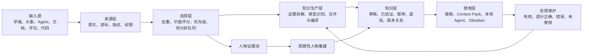

# IKB 个人知识库完整落地方案

> 文档性质：IKB 知识生产与使用闭环的当前主方案<br>
> 版本：V1.4<br>
> 基线时间：2026-08-10<br>
> 数据范围：本机 `/Users/htwu/projects/ikb/ikb-data`<br>
> 方案状态：低损耗抽取纵向切片已落地；存量重编译、持续语义消费和真实任务回归仍待完成<br>
> 隐私边界：公司知识仅保存在本机，不进入公开或个人 GitHub 仓库

## 1. 这份方案解决什么问题

IKB 已经能够从学城、大象、Agent 会话、文档和评论中保存原始输入，也具备 Task、Run、Artifact、Ledger、Knowledge、Obsidian、检索和反馈等基础能力。当前主要问题不是没有输入，而是输入没有持续加工成可使用的知识。

截至本方案基线时间，IKB 已保存 2231 个 Source、62016 条记录；525 条 Experience 被筛选为值得分析，但只有 22 条完成分析，503 条仍在队列中。Work 知识共 41 条，全部仍是 draft；其中 15 条获得过至少一次 helpful 反馈。10 个关键人物都有本地证据，但全部处于 `analysis_due`。这些数据说明，采集和确定性治理已经具备基础，知识生产、验证和维护尚未形成持续闭环。

本方案把系统终点重新定义为：

> 给本地 Agent 一个真实工作任务，它能够找到正确知识，知道知识是否可信、适用于哪里，并据此改善最终结果。

Source 数量、Knowledge 数量、Run 成功和 lint 通过都是过程信号，不能单独证明知识库可用。

## 2. 目标与边界

### 2.1 建设目标

IKB 最终需要具备以下能力：

- 持续获取工作和个人信息，原始证据不丢失、不重复、可增量更新；
- 按业务领域、决策、执行手册、项目、人物、写作与沟通等类型加工知识；
- 同一主题可以合并多个来源，重跑时更新已有知识，不制造平行旧版本；
- 本地 Agent 在编码、评审、CR、写文档、沟通和项目管理时能够直接检索和使用；
- 知识使用后记录 helpful、partial、incorrect 或 unused，错误会暂停并进入修订；
- 人物知识只有在身份、时效和置信度满足门禁时才能参与个性化建议；
- 人能通过 Obsidian、Markdown 评审包和本地 HTML 报告查看知识及其依据。

### 2.2 当前不做

- 不走 SpecX 或 OpenSpec；
- 不依赖 Opik；
- 暂不建设 Multica 类任务界面；
- 不把公司知识上传 GitHub；
- 不通过大象发送消息、表情、评论或执行群操作；
- 不为了提高数量，强迫低价值输入生成 Knowledge；
- 不把原文摘要当成最终知识产品。

### 2.3 已确定的外部读取约束

- 学城读取上限为每半小时 10 篇；
- 已有相同内容指纹的学城文档不重复读取；
- 大象永久只读，按人物、群和时间游标增量获取；
- 本地预检失败不应消耗外部读取配额；
- 权限不足、空内容、本地环境错误和远端失败必须分别记录。

## 3. 当前问题与根因

### 3.1 日常维护没有执行知识生产

当前维护链路主要完成本地记忆同步、历史导入、原始数据去重、Session Triage、候选发现、人物投影、索引重建、lint、reasoning、doctor 和报告。它没有稳定执行语义分析、知识编译、知识修订和真实任务验证。

因此，系统可以持续增加 Source 和候选，却不会持续增加可用知识。`knowledge rebuild` 只重建索引和视图，不会把待分析输入编译成 Knowledge。

### 3.2 把结构正确当成内容正确

当前测试和门禁擅长验证字段、引用、状态、幂等、事件和文件是否正确，但不能证明：

- 是否保留了足够业务细节；
- 结论是否失真；
- 是否遗漏关键分支、例外和反例；
- Agent 在真实任务中能否使用；
- 人物结论是否来自正确的人和足够的时间跨度。

389 个自动化测试全部通过，证明确定性机制已有较好基础，不能替代知识内容验收。

### 3.3 抽取模板没有真正按类型运行

业务领域、操作手册、决策、项目、人物和写作风格需要不同的编译结构。此前虽然补充了类型概念，但维护任务没有调用对应的语义编译过程，实际产物仍容易退化为通用摘要。

### 3.4 没有用消费者结果约束生产

此前主要检查 Knowledge 是否生成，没有持续检查它在编码、CR、文档、沟通和项目管理任务中的效果。检索命中也被误当成知识有用，导致无使用反馈的知识长期保留在活动区。

### 3.5 重跑和版本替换不完整

部分主题重跑后，新旧文件同时存在；活动知识仍可能引用已经归档的旧知识。当前缺少统一的主题身份、活动版本约束和关系迁移门禁。

## 4. 目标功能架构

IKB 的产品功能收敛为六个环节。Task、Run、Artifact、Ledger、Approval 和门禁作为横向控制能力，不再成为独立建设目标。



### 4.1 保留的现有能力

- Source 原始证据、记录和内容指纹；
- Work 与 Personal 范围隔离；
- Task、Run、Artifact、Ledger；
- Knowledge 状态、lint、反馈和归档；
- Obsidian Vault；
- CLI 搜索和 Context Pack；
- doctor、健康检查、本地报告。

### 4.2 需要调整的边界

- Candidate、Experience 和 Analysis 归入同一个知识生产域，对外只暴露明确状态和契约；
- Eval 和 Observation 作为知识生产及使用过程中的横向能力；
- Harness 只负责执行记录、恢复和门禁，不负责定义知识内容；
- IKB 主架构删除 SpecX、OpenSpec 和 Opik 依赖；
- 日常维护必须直接驱动知识生产，不再只做导入和索引。

## 5. 核心对象与职责

### 5.1 Source：原始证据

Source 负责忠实保存，不直接表达最终知识。

每个 Source 至少记录：

- 来源类型、原始地址或本地路径；
- 作者、时间、人物、群和项目；
- 原文、评论、图片、附件及其关系；
- 内容指纹、版本和增量游标；
- 是否采集完整；
- 工作或个人范围；
- 权限、密级和允许的使用方式。

相同指纹不重复导入；内容变化时保存新版本，不覆盖历史原文。

### 5.2 Evidence：证据单元

Evidence 是 Source 中可单独引用的事实或观察，不作为正式知识展示。

一条 Evidence 至少包含：

- 原始陈述；
- 谁在什么时间、什么场景下表达；
- 对应 Source 和精确位置；
- 类型：事实、规则、决策、经验、观点、偏好、行动或反例；
- 时间状态：现行、历史、规划或未知；
- 可靠性：直接事实、权威文档、多人印证、单人观察或模型推断；
- 关联的业务对象、项目和人物。

Evidence 层用于避免长文直接被压缩成几句摘要，也让一张 Knowledge 可以组合多份 Source。

### 5.3 Experience：待验证经验

Experience 保存可能有价值、但还不能成为稳定知识的内容，例如一次非显然修复、一次人工纠偏、一次 Verifier 驳回或一条新的评审思路。

经验升级为 Knowledge Candidate 至少满足以下一项：

- 三个独立 Run 得到相同结论；
- 两个独立 Run，加一次真实任务验证。

不满足时继续积累，不硬生成方法论。

### 5.4 Knowledge：可使用的知识产品

Knowledge 必须回答：

- 它描述什么；
- 包含哪些完整事实；
- 什么时候可以使用；
- 应该怎样使用；
- 哪些场景不能使用；
- 来源、时效和置信度是什么；
- 已经如何验证；
- 出现冲突时怎样处理。

统一生命周期：

```text
draft → pending_review → verified
   ↘ hold → revised
   ↘ retired
```

同一主题只允许一个活动版本。内容没有变化时不生成新文件；内容增加时修订当前卡；结论被推翻时退役旧卡，并记录替代关系。

## 6. 抽取完整度保障机制

知识完整度不能靠正文长度、Agent 自评或“看起来覆盖了重点”判断。IKB 需要同时证明两件事：原始输入中的重要内容没有被静默遗漏；Knowledge 中的每个重要主张都有原始证据。前者防止漏抽，后者防止硬编。

完整不等于把全文复制进一张卡。IKB 使用三层产物保存不同密度的信息：

- Source 保存完整原文和附件；
- Fact Package 保存接近无损的结构化事实；
- Knowledge View 面向具体消费者组织事实、规则、决策和行动方式。

Knowledge View 可以精简，但不能成为 Fact Package 的一句话指针；它必须直接包含完成目标任务所需的事实，并能继续下钻到完整事实和 Source。

### 6.1 完整度的五个维度

| 维度 | 要解决的问题 | 判定方式 |
| --- | --- | --- |
| 来源完整度 | 原文的章节、图片、表格、评论和附件是否都处理过 | 每个内容单元都有终态和原因 |
| 事实完整度 | 重要事实、规则、例外、决策和反例是否被保留 | 高价值 Evidence 全部进入事实清单或明确跳过 |
| 类型完整度 | 领域包、人物档案等是否包含该类型应有的结构 | 每个适用维度已覆盖，缺失项明确记为 Gap |
| 使用完整度 | 目标任务需要的问题能否由知识直接回答 | `questions_answered` 与真实任务用例逐项核对 |
| 追溯完整度 | 是否既能从 Source 找到产物，也能从结论回到 Source | 双向覆盖矩阵无悬空单元和无来源主张 |

五个维度分别报告，不能用一个总分互相抵消。来源完整但类型不完整，或者结构完整但无法回答任务，都不能通过门禁。

### 6.2 先生成来源结构清单

分析开始前，确定性代码先把 Source 拆成可检查的内容单元，并生成“来源结构清单”。不同来源的单元不同：

- 学城文档：标题、正文段落、章节、表格、图片、Drawio、附件和评论；
- 大象：消息、回复关系、引用内容、发送人、时间、群和上下文窗口；
- Agent 会话：用户指令、Agent 结论、人工纠偏、失败、重试、验证结果和重要工具产物；
- 代码与评审：文件、Diff、评论、处理结果、测试和最终合入状态；
- 普通文档：章节、表格、图片、脚注、修订和评论。

每个内容单元必须进入以下终态之一：

```text
extracted          已形成 Evidence
context_only       只作为上下文保留，不形成独立事实
duplicate          与已有 Evidence 重复
no_durable_value   没有长期使用价值
unreadable         当前无法读取
blocked            权限、格式或依赖阻断
```

`context_only`、`duplicate` 和 `no_durable_value` 必须记录原因及目标引用。高价值图片、表格、评论或附件处于 `unreadable/blocked` 时，该 Source 不能被标记为分析完成。

建议批次产物使用可读中文文件名：

```text
来源结构清单.json
事实清单.json
知识编译稿.md
完整度矩阵.json
完整度验证报告.md
```

这些文件属于 Run Artifact，带 Source 指纹、生成时间、Agent、Skill 和内容哈希。后续重跑能够判断使用的是不是同一份输入。

### 6.3 采用“保真抽取、类型编译、完整度复核”三步流程

保真抽取阶段只回答“原文说了什么”，不急于总结。Agent 按来源结构清单逐单元提取实体、关系、流程、状态、规则、例外、决策、数据、经验、人物观察和反例；每条事实保留原始位置、作者、时间和时间状态。相同事实可以去重，但不能因为准备生成一张短卡就省略其他事实。

类型编译阶段回答“这些事实以后怎样使用”。编译器先判断产物类型，再从事实清单组合业务领域包、实体卡、流程卡、决策记录、执行手册、项目知识或人物观察。一份 Source 可以产生多个 Knowledge View；一张 Knowledge 也可以合并多份 Source。编译器不能直接从原文标题和摘要生成最终卡。

完整度复核阶段同时做正向和反向检查。正向从 Source 出发，确认每个高价值内容单元落到了 Evidence、Knowledge、Gap 或明确的跳过记录；反向从 Knowledge 出发，确认每个关键主张都能回到 Evidence 和 Source。任何一边出现悬空，批次都不能通过。

### 6.4 双向完整度矩阵

每个分析批次生成一张机器可检查、人工可阅读的矩阵：

| 内容单元 | 重要性 | Evidence | Knowledge/Gap | 处置状态 | 原因 |
| --- | --- | --- | --- | --- | --- |
| 原文第 3.2 节 | 关键 | fact-001～fact-008 | 预订领域包/验价流程 | extracted | 主流程与异常分支 |
| 架构图 2 | 关键 | fact-009～fact-015 | 服务关系视图 | extracted | 补充正文未描述的调用关系 |
| 评论 17 | 重要 | fact-016 | 决策边界 | extracted | 明确不使用 Mock |
| 背景介绍 | 上下文 | 无 | Source | context_only | 不包含独立长期事实 |

矩阵提供两种查询：

- `source → evidence → knowledge/disposition`：检查原始内容有没有漏掉；
- `knowledge claim → fact_ref → source unit`：检查知识有没有失真或硬编。

不能只保存第二种引用。当前 Knowledge 虽然大多有 source_refs，但缺少 Source 到产物的反向覆盖，所以无法证明没有漏抽。

### 6.5 按知识类型检查完整结构

每种知识有自己的“适用维度清单”。每个维度必须标记为 `covered`、`not_applicable`、`gap` 或 `blocked`，不能用空段落假装完整；`not_applicable` 必须写明原因。

| 知识类型 | 必查维度 |
| --- | --- |
| 业务领域包 | 术语、实体、关系、流程、状态、规则、例外、接口、数据、服务、上下游、演进、决策、风险、验证入口 |
| 实体卡 | 字段或属性、身份、关系、生命周期、不变量、创建与变更入口、兼容边界 |
| 流程卡 | 触发、前置条件、节点、分支、输入输出、异常、补偿、恢复、观测和验证 |
| 决策记录 | 背景、约束、候选方案、取舍、结论、影响、状态和重评条件 |
| 执行手册 | 触发、输入、步骤、分支、检查点、失败处理、回滚、停止条件和示例 |
| 项目知识 | 目标、范围、当前状态、决策、依赖、负责人、风险、阻断、下一步和变更历史 |
| 人物档案 | 身份、时间窗口、场景、直接观察、重复模式、反例、置信度、适用用途和禁止用途 |
| 写作与沟通 | 受众、真实样本、修改前后、保留与删除、重复偏好、反例和场景边界 |

文档没有提供某个维度时，产物应明确写“当前来源未覆盖”，而不是由 Agent 补齐常识。Gap 本身是可维护知识，后续可以由代码、其他文档或真实验证补充。

### 6.6 完整度硬门禁

一批知识只有同时满足以下条件，才能从 Analysis 进入 Curation：

- 来源结构清单中的内容单元 100% 有终态；
- 与目标用途相关的关键和重要单元全部形成 Evidence、Gap 或有证据的跳过记录；
- Knowledge 的关键主张 100% 具有 `fact_refs`；
- 类型要求中的适用维度 100% 为 `covered`，或明确进入 `gap/blocked`；
- 所有检测到的冲突和反例已经在 Knowledge 或 Gap 中可见；
- 每个 `questions_answered` 都能定位到具体正文和 Evidence；
- 原始 Source 指纹、事实清单指纹和编译产物指纹一致。

完整度门禁不要求每个 Source 都生成 Knowledge，也不以 Knowledge 数量为目标。它要求所有高价值内容都被看见、被处置，并且不会在摘要过程中静默消失。

### 6.7 分层保存，解决“完整”和“好用”的冲突

一张面向任务的 Knowledge View 不应该塞入整篇原文，但底层事实不能丢。IKB 使用以下阅读路径：

```text
索引卡：告诉用户有哪些知识
  → Knowledge View：直接支持一个任务或判断
    → Fact Package：保留完整结构化事实、Gap 和冲突
      → Source：原文、图片、评论和附件
```

Agent 默认读取 Knowledge View；遇到高风险决策、draft、冲突或细节不足时下钻 Fact Package 和 Source。Obsidian 中每一层都有可点击链接。这样既避免一句话抽象，也不要求每次任务把完整原文塞进上下文。

### 6.8 增量抽取和重跑

Source 指纹不变时不重复抽取。指纹变化时，先比较来源结构清单，只处理新增和变化单元，再计算受影响的 Evidence 和 Knowledge：

- 新事实补充现有 Fact Package；
- 已有事实变化时形成冲突或修订，不静默覆盖；
- 删除或失效事实触发相关 Knowledge 重新验证；
- 只更新受影响的 Knowledge View；
- 保存本次与上次完整度矩阵的 Diff；
- 重跑后旧活动知识进入 revised 或 retired，不与新卡并存。

人物证据仍按增量进入 dossier，但人物 Knowledge 只在周期性重建时统一比较 `added`、`unchanged`、`superseded`、`conflicted` 和 `unknown`。

### 6.9 完整度验证用例

代码层至少固化以下回归用例：

- 从测试文档删除一个章节的提取结果，完整度验证必须失败；
- Knowledge 添加一个没有 fact_ref 的关键结论，验证必须失败；
- 高价值图片未解析，Source 不能进入 analyzed；
- 评论中的边界没有进入事实清单，验证必须失败；
- 同一 Source 重跑不产生新 Knowledge；
- Source 只修改一个章节，仅相关 Evidence 和 Knowledge 发生变化；
- 一篇文档同时包含领域事实和决策时，能够生成 Fact Package 与不同类型 View；
- 内容没有长期价值时，不生成 Knowledge，但来源结构清单仍然闭合。
- 两个 Candidate 使用同一 `canonical_key` 时，不能同时成为活动知识；
- Candidate 没有独立问题、消费者或生命周期时，必须合并、修订或跳过；
- 一个大领域包包含需要独立执行的流程时，能够拆出流程 View，同时不复制整份领域正文。

现有 `ikb extraction validate` 负责检查结构、指纹和字段；`ikb extraction verify` 需要扩展为完整度验证器，检查来源覆盖、类型义务、双向引用和增量 Diff。验证报告必须注册为 Artifact，Curator 只能消费通过验证的 Compilation。

### 6.10 批次报告怎样展示完整度

每批报告直接展示：

- Source 总数和完整读取数；
- 内容单元总数，以及 extracted、context_only、duplicate、no_durable_value、unreadable、blocked 分布；
- Evidence 数量及类型分布；
- 新增、修订、进入 Gap、进入人物证据池和跳过的 Knowledge 结果；
- 每种知识的类型维度覆盖；
- 未解决冲突、未读取图片和未处理评论；
- 正向覆盖和反向引用检查结果；
- 与上次重跑相比新增、变化和退役的内容。

用户不需要阅读所有机器记录，但可以从报告打开完整度矩阵、Knowledge、Fact Package 和原始 Source，逐层复核。

### 6.11 用“最小充分知识集”控制产物数量

IKB 不规定一篇文档必须生成几张 Knowledge，也不规定一个批次至少或至多生成多少张。固定数量会同时制造两个问题：信息丰富的文档被压缩得太少，重复或低价值输入又被迫生成大量卡片。

数量控制以“最小充分知识集”为目标：覆盖目标用途所需的事实和问题，同时只保留具有独立消费者、独立生命周期或独立使用边界的 Knowledge View。

防止产出太少依靠以下门禁：

- 关键和重要 Evidence 已经全部处置；
- 类型适用维度已覆盖或明确记录为 Gap；
- 目标消费者的问题全部由 Knowledge 回答，或明确显示当前知识不足；
- 一张卡不能用一句摘要代替完整 Fact Package；
- 如果现有 Knowledge 无法承载某个独立业务对象、流程、决策或执行契约，必须生成新的 View。

防止产出太多依靠以下门禁：

- Source 与 Knowledge 不是一对一关系，一份 Source 可以不生成卡，也可以更新多张已有卡；
- 新 Candidate 必须至少回答一个现有活动知识无法回答的具体问题，或服务一个不同的消费者、生命周期或权限范围；
- Candidate 的事实、问题、适用范围和使用方式完全被现有卡覆盖时，只能进入 duplicate、merge 或 revise，不能新建；
- 同一规范身份只允许一个活动版本；
- 没有明确消费者、`questions_answered` 或使用场景的 View 不发布；
- 索引卡只负责导航，不能复制领域包正文；原子卡只在需要独立检索、独立更新或独立验证时创建。

每张 Knowledge 增加稳定的规范身份：

```text
canonical_key = scope + subject + product_type + applicability_boundary
```

同一 `canonical_key` 已有活动知识时，默认动作是 revise 或 merge。时间状态互相冲突时保留历史版本，但只有当前版本参与默认检索。

编译阶段先生成“候选 View 覆盖表”，再决定最少需要哪些 View：

| Candidate | 覆盖的独立问题 | 使用者 | 生命周期 | 与现有知识关系 | 处置 |
| --- | --- | --- | --- | --- | --- |
| 预订领域包 | 预订有哪些实体、流程、状态和服务 | 编码、方案、评审 | 随领域演进 | 修订现有领域包 | revise |
| 验价流程卡 | 验价如何触发、分支、失败和恢复 | 编码、排障 | 随流程演进 | 领域包未提供可执行流程 | new |
| 验价简介 | 验价是什么 | 无独立消费者 | 同领域包 | 内容被领域包包含 | skip |
| 某次验价故障 | 本次故障原因和复查动作 | 复盘、排障 | 事件历史 | 可形成独立经验 | Experience |

Candidate 满足以下条件时合并：

- 描述同一业务对象和同一知识类型；
- 面向相同消费者，回答的问题高度重合；
- 适用范围、时间状态、可信等级和更新节奏一致；
- 合并后仍保持单一职责，正文不会混入另一种使用契约。

Candidate 满足以下条件时拆分：

- 分属不同知识类型，例如领域事实与架构决策；
- 一个需要独立检索或独立执行，另一个只提供背景；
- 更新频率、权威来源或时间状态不同；
- Work、Personal、敏感范围或允许用途不同；
- 两个结论存在冲突，不能在同一活动视图中同时成立；
- 合并后需要同时服务互不相关的任务，导致正文无法保持单一职责。

不同知识的数量策略：

- 业务领域：每个领域和当前版本保留一份完整 Fact Package；实体、流程、决策和手册只有在具有独立用途时才生成 View；
- 项目：每个项目保留一张持续更新的项目卡，关键决策和可复用执行手册独立维护，不为每日状态生成新卡；
- 人物：每个人保留一个可重建 dossier；一条消息只增加 Evidence，只有稳定且可使用的模式才生成观察卡；
- 写作：同一场景的反复修改合并进一份风格或手册，只有受众、用途或约束发生实质变化时拆分；
- 故障和经验：单次事件先进入 Experience，达到复用和验证门槛后再形成 Knowledge。

每周维护执行一次知识压缩检查：

- 按 `canonical_key` 检查多个活动版本；
- 检查 `fact_refs`、`questions_answered`、适用范围和正文的重叠；
- 找出长期没有消费者、只有 unused 反馈或被其他卡完全覆盖的 View；
- 对重复项生成 merge/revise 建议，不直接删除可追溯历史；
- 对过大的领域包检查是否存在需要独立检索和独立维护的子 View。

最终数量由“覆盖下限”和“唯一价值上限”共同决定：所有重要事实和目标问题必须被覆盖；每张活动 Knowledge 又必须证明自己有不可被其他活动知识替代的用途。卡片数量本身不作为成功指标。

### 6.12 量化原始知识与产出知识的信息差

IKB 可以明确报告产出相对原始来源差多少，但不能用字数差、向量相似度或一项综合评分代替语义比较。原文缩短 90% 不代表丢失 90% 的有效知识；一篇很长的背景介绍可能只有少量长期事实，一句被漏掉的否定规则却可能改变整个方案。

比较需要围绕原子事实和目标用途分三段进行：

```text
Source 原子事实 S
  → Fact Package 事实 F：检查来源事实召回
    → Knowledge View 主张 V：检查任务信息保留
      → Source：反向检查主张是否被支持
```

每个批次生成“信息损耗账本”，至少记录四组集合：

- `S`：Source 中识别出的原子事实、规则、例外、决策、反例和上下文单元；
- `F`：Fact Package 中保留的结构化事实；
- `V`：Knowledge View 中实际表达的原子主张；
- `Q`：该 Knowledge 声明能够回答的任务问题。

每个 `S` 单元与 `F/V` 建立语义对齐，状态只能是：

```text
preserved      原义保留
paraphrased    等价改写
aggregated     与其他事实合并，原约束仍保留
view_omitted   未进入当前 View，但保留在 Fact Package
gap            证据不足，明确展示缺口
conflicted     来源之间冲突
discarded      无长期价值，有明确原因
lost           应保留但未保留
```

每个 `V` 主张反向标记为：

```text
supported      来源直接支持
partially_supported  只支持部分内容
contradicted   与来源冲突
unsupported    找不到来源
```

`lost`、`partially_supported`、`contradicted` 和 `unsupported` 都是失败信号，不能通过语言润色隐藏。

#### 6.12.1 需要分别报告的指标

| 指标 | 计算 | 回答的问题 |
| --- | --- | --- |
| 关键事实召回率 | Fact Package 已保留的 P0 事实 / Source 中全部 P0 事实 | 最重要的信息有没有漏 |
| 重要事实处置率 | P1 中 preserved、aggregated、gap、conflicted、discarded 的数量 / 全部 P1 | 重要信息是否都被看见和解释 |
| 主张支持精度 | supported 的 Knowledge 原子主张 / 全部 Knowledge 原子主张 | 产出的知识有没有硬编或失真 |
| 任务信息保留率 | Knowledge 可回答的问题 / 声明的 `questions_answered` | 当前 View 是否足够完成目标任务 |
| 冲突暴露率 | 已在 View 或 Gap 中展示的已知冲突 / 检测到的冲突 | 是否把不一致静默抹平 |
| 语义损耗率 | 应保留但标记为 lost 的加权事实 / 全部应保留事实 | 相对目标用途实际丢了多少 |
| 压缩比 | Knowledge View 字数或 token / Source 字数或 token | 文本缩短了多少，只作描述 |

加权事实召回可以写成：

```text
weighted_recall = Σ(weight_i × covered_i) / Σ(weight_i)
semantic_loss = 1 - weighted_recall
```

综合数值只用于趋势观察，门禁仍逐项判断。P0 漏一条不能被大量 P2 背景覆盖抵消。

事实优先级按影响确定：

- P0：业务规则、否定约束、例外、状态跃迁、不变量、金额和指标口径、接口契约、最终决策、反例、人物归属；
- P1：实体关系、流程节点、服务职责、因果解释、候选方案和验证路径；
- P2：背景、举例、重复解释、修辞和只影响阅读顺序的内容。

优先级由 Agent 初判，确定性规则负责识别数字、否定词、条件、异常、状态、作者和引用关系等高风险信号。P0/P1 的任何降级或丢弃都必须出现在报告中。

#### 6.12.2 信息损耗报告示例

```text
来源：某验价设计文档 + 18 条评论
原始内容单元：142
原子事实：86（P0=18，P1=47，P2=21）

Source → Fact Package
- P0：18/18 保留，召回率 100%
- P1：44 保留，2 个 Gap，1 个冲突，处置率 100%
- P2：9 保留，12 个 context_only
- 未处理图片：0
- 未处理评论：0

Fact Package → Knowledge View
- 生成：领域包修订 1、验价流程卡 1、决策记录 1
- View 使用事实：52
- 只在 Fact Package 保留：31
- 声明问题：14，能够回答：14

Knowledge View → Source
- 原子主张：61
- supported：61
- partially_supported：0
- contradicted：0
- unsupported：0

结果：关键语义损耗 0；重要事实无未解释损耗；文本压缩比 28%
```

以后不能只报告“生成了三张知识”。报告必须说明原始事实有多少、保留多少、只放在 Fact Package 多少、明确丢弃多少、发生冲突多少，以及每个 Knowledge 新增或替代了什么。

### 6.13 低损耗抽取算法

IKB 不再使用“把整篇文档总结成知识”的单次 Prompt。长文中间位置的信息更容易被模型忽略，直接压缩还会把规则、反例和人物归属融合成无法验证的句子。抽取改为以下过程。

#### 6.13.1 按原始结构分段，不按固定 token 粗切

优先使用标题、段落、表格、图、评论线程、消息回复链和代码 Diff 作为边界。超过上下文限制时才在结构内部继续切分，并保留相邻上下文、父标题和稳定锚点。每个分段都独立生成内容单元和原子事实，不能先生成摘要再从摘要抽取。

长文采用分层处理：叶子层保存原文片段和原子事实，中间层聚合同一实体、流程和决策，顶层才形成领域或项目视图。上层摘要不能替换下层事实。这一做法借鉴多阶段长文总结和分层检索，但 IKB 将下层 Evidence 作为事实源，不把递归摘要当成事实源。

#### 6.13.2 先抽事实，再组织知识

第一遍只提取原子事实和关系，不要求简短，也不生成方法论。每条复杂句拆成可以单独验证的主张；数字、条件、否定、例外、归属和时间不能合并丢失。

跨段聚合时使用实体、流程节点、决策主题和时间轴去重。合并只消除重复表达，不删除新增约束。两份来源不一致时生成 `conflicted`，不选择看起来更合理的一方。

#### 6.13.3 用问题反查遗漏

根据知识类型自动生成覆盖问题。例如领域包生成“有哪些实体、状态、规则、例外、服务、接口和失败路径”；决策记录生成“有哪些候选方案、为什么拒绝、何时重评”；人物档案生成“哪些场景、时间、直接行为和反例支持这一观察”。

Verifier 分别使用 Source 和 Fact Package 回答同一组问题，并比较答案：

- Source 能回答、Fact Package 不能回答，说明保真抽取发生遗漏；
- Fact Package 能回答、Knowledge View 不能回答，但该问题属于 `questions_answered`，说明编译损耗；
- Knowledge View 给出 Source 不支持的答案，说明新增或失真。

问答评估用于语义覆盖，不用词面相似度替代。

#### 6.13.4 迭代补充缺失事实，不强行压缩到固定长度

初稿生成后，Verifier 列出“相关、具体、来源存在、当前 View 未包含”的缺失事实。Compiler 逐轮补充，直到 P0/P1 没有未解释缺口。迭代过程中每轮都重新拆解 Knowledge 原子主张，检查是否为了增加密度而删除已有条件或制造难读的融合句。

迭代增密只用于发现遗漏，不设固定字数。内容过长时通过拆分独立 View 和分层读取解决，不通过删掉关键事实解决。

#### 6.13.5 使用独立 Verifier，而不是让生成者自报完整

Compiler 产出 Knowledge 后，Verifier 使用冻结的 Source 指纹、来源结构清单、事实清单和候选 View 独立核对。Verifier 不读取 Compiler 的中间推理，只接收可复放产物；它输出逐事实对齐和失败项，不能只给“完整度 90 分”。

确定性代码验证 ID、哈希、双向引用、集合覆盖和状态；Agent Verifier 判断语义是否等价、是否丢失条件和是否发生错误聚合。高风险 P0 失败时进入人工确认或重新编译。

#### 6.13.6 发布门槛

Fact Package 进入 Curation 前必须满足：

- P0 关键事实召回率为 100%；
- P1 重要事实处置率为 100%，允许 Gap 和 conflict，不允许静默遗漏；
- 所有已识别图片、表格、评论和附件都有终态；
- Source 能回答而 Fact Package 无法回答的必需问题为 0。

Knowledge View 进入活动区前必须满足：

- 关键主张支持精度为 100%；
- partially_supported、contradicted 和 unsupported 主张为 0；
- 声明的 `questions_answered` 全部能够回答，不能回答的移入 Gap；
- 已知冲突暴露率为 100%；
- 当前用途的 P0/P1 未解释语义损耗为 0。

压缩比没有固定门槛。只要上述条件满足，长知识和短知识都可以；条件不满足时，写得再长也不能发布。

#### 6.13.7 研究依据及 IKB 取舍

- FActScore 将长文本拆成原子事实，再计算被可靠来源支持的事实比例，适合 IKB 的主张支持精度；论文也明确指出它不能单独解决召回问题，因此 IKB 必须增加 Source 事实召回。
- QAEval 用问答衡量摘要与参考内容的信息重合，说明只看词面重合不足；IKB 用同问题分别询问 Source、Fact Package 和 Knowledge View。
- Pyramid Method 使用语义内容单元评价内容选择；IKB 将内容单元扩展为有重要级别、来源权威和使用范围的 Evidence。
- SummN 对长输入采用多阶段处理；IKB 保留分段 Evidence，再逐层聚合，不让中间摘要覆盖叶子事实。
- Chain of Density 通过多轮加入遗漏实体提高信息密度，同时发现密度和可读性存在取舍；IKB 只使用“查找遗漏并增密”，不使用固定长度约束。
- Lost in the Middle 表明模型利用长上下文时会受信息位置影响；IKB 因此按结构逐段抽取，并以来源结构清单验证每段都被处理。
- RAPTOR 使用不同抽象层次的树形内容支持长文检索；IKB 借鉴多层读取，但把 Source 和 Evidence 保留为唯一事实依据。

## 7. 知识产品及编译契约

### 7.1 业务领域包

业务领域包不是文章摘要，至少包含：

- 业务范围、术语和核心实体；
- 实体关系、主流程、分支和状态变化；
- 业务规则、例外和冲突；
- 服务职责、接口、数据、消息和上下游；
- 失败场景及排查入口；
- 历史演进、当前状态和规划；
- 已确认事实、推断和待确认项；
- 编码、评审和方案设计时的使用方式。

验收问题：给 Agent 一项相关需求，它能否判断影响哪些流程、系统、接口、状态和验证路径。

### 7.2 执行手册

执行手册用于编码、CR、故障排查、文档评审等场景，至少包含：

- 触发条件和所需输入；
- 分步骤动作和分支判断；
- 每一步的检查点；
- 失败处理和停止条件；
- 回滚或恢复方式；
- 真实正例、反例和最终产物标准。

### 7.3 决策记录

决策记录至少包含：

- 背景和当时约束；
- 候选方案及权衡；
- 最终结论；
- 负责人和影响范围；
- 当前状态；
- 重新评估条件。

只保存结论、不保存取舍过程的内容不能成为完整决策知识。

### 7.4 项目知识

项目知识持续维护：

- 目标、范围和非目标；
- 当前架构和目标架构；
- 已完成、未完成和最近变化；
- 关键决策；
- 负责人、参与人和上下游依赖；
- 当前风险、阻断和下一步行动；
- 相关文档、代码、群和任务。

项目知识需要直接服务任务管理和 Agent 的跨会话接管。

### 7.5 人物档案

人物档案单独管理，不随每条新消息即时重建。

内容分为四层：

1. 身份事实：职责、负责范围、参与项目；
2. 场景观察：某次评审、沟通或文档中的直接行为；
3. 稳定模式：跨时间、跨场景重复出现的关注点和决策方式；
4. 使用建议：怎样汇报、沟通、评审，以及哪些推断不能做。

人物置信度门禁：

- 单次证据只能形成观察，不能推导稳定偏好；
- 至少三个独立事件、覆盖两个场景，才能形成中等置信度模式；
- 高置信度需要覆盖更多时间窗口和场景，并完成反例搜索；
- 存在未解决反例时，不能给出确定性人物建议；
- 新证据导致档案进入 `analysis_due` 后，旧卡停止参与个性化检索；
- 指定人物没有合格档案时返回“当前证据不足”，不能返回其他人物补位。

### 7.6 写作与沟通知识

写作和沟通知识从真实文档、修改记录、评论和对话中提取：

- 不同受众关注什么；
- 用户保留、删除和重写了什么；
- 常见结构和被多次纠正的表达；
- 修改前后对照；
- 不同场景的模板和禁止表达；
- 已确认的个人偏好。

只有抽象原则、没有真实对照样本的内容不能升级为 verified。

## 8. 存量重加工流程

### 8.1 采集背压

当前已有足够原始输入。存量消化期间，只保留：

- 本地 Agent 历史增量同步；
- 用户直接指定的学城文档；
- 已选群和人物的大象增量；
- 必要的文档评论补充。

分析积压超过阈值时停止探索性学城发现。优先消化本地 Source，不因为外部限频让本地分析停住。

### 8.2 价值优先级

候选按以下顺序处理：

1. 当前负责业务和正在推进的项目；
2. 预订、验价、生单、辅营等核心领域；
3. 关键人物参与的文档、评论和对话；
4. 历史决策、故障复盘和非显然修复；
5. 写作、评审和沟通中的人工纠偏；
6. 通用经验和低频材料。

同一优先级内，再按当前性、来源可靠性、复用范围和证据完整度排序。

### 8.3 每批处理契约

每批先冻结输入清单，然后依次完成：

1. 检查 Source 是否完整；
2. 按章节拆解 Evidence；
3. 识别知识类型；
4. 检索已有 Knowledge；
5. 决定新增、合并、修订、进入人物证据池或跳过；
6. 生成完整知识产品；
7. 执行证据校验和使用测试；
8. 更新唯一活动版本；
9. 生成中文评审包和批次报告。

每个输入必须有终态：

- 生成新知识；
- 修订已有知识；
- 进入 Experience；
- 进入人物或项目证据池；
- 与已有内容重复；
- 内容不足，明确跳过；
- 因证据冲突进入 hold。

没有生成 Knowledge 可以是正确结果，但必须说明提取了什么、为什么不生成、还缺什么证据。

### 8.4 现有知识清理

- 8 条旧版 QV3 重建或隔离；
- 2 条已有反例的知识保持 hold，修订后再恢复；
- 40 条批量 verified 的个人知识逐条重新分级；
- 现有 13 条人物知识暂停个性化使用，等待重建；
- 指向归档知识的关系迁移到当前活动版本；
- 合并重复主题，清理没有消费者的机械关系；
- Work 和 Personal 的孤立节点只在存在真实语义关系时连接。

## 9. 持续增量循环

### 9.1 每日循环

```text
本地增量同步
→ 去重和指纹检查
→ Session Triage
→ 候选价值排序
→ 处理一批本地待分析输入
→ 编译或修订知识
→ 重建索引
→ 运行消费回归
→ 生成日报
```

Agent 会话默认不读取完整工具输出。只有出现以下信号才进入分析队列：

- 失败、阻断或重试；
- 人工纠偏；
- Verifier 驳回；
- 非显然修复；
- Knowledge 反馈为 partial 或 incorrect；
- 新的决策、规则或排查路径；
- 用户明确要求沉淀。

### 9.2 每周循环

- 聚类 Experience；
- 识别重复出现的方法和问题；
- 重建达到条件的人物档案；
- 检查过期、冲突和长期未使用知识；
- 分析本周真实任务反馈；
- 生成待修订清单；
- 决定下一周最有价值的存量输入。

### 9.3 人物重建触发

人物不会每发现一条证据就重建。满足以下任一条件时进入重建队列：

- 到达固定周度检查点；
- 新增证据跨越新的场景或时间窗口；
- 出现与既有模式冲突的反例；
- 人物职责或负责范围发生变化；
- 用户要求针对该人物形成沟通或评审建议。

## 10. Agent 使用契约

本地 Agent 执行任务前，根据任务类型获取 Context Pack。Context Pack 必须携带：

- Knowledge 状态和置信度；
- 适用范围和停止条件；
- 时间状态和最近复核时间；
- 关键证据；
- 已知冲突；
- 本次命中原因。

使用规则：

- verified 只能在声明边界内使用；
- draft 只能作为辅助，关键结论需要回看 Source、当前代码或运行结果；
- hold、retired 和过期人物知识不能进入 Context Pack；
- 当前代码、运行结果和用户直接指令优先于知识库；
- 没有可靠知识时允许返回空结果；
- 发送消息、发布文档和生产变更仍需单独授权；
- Agent 只为实际影响结果的 Knowledge 记录反馈，不能因为检索命中就标记 helpful。

不同任务的主要知识输入：

| 任务 | 优先使用的知识 |
| --- | --- |
| 编码 | 架构、接口、状态、不变量、已知坑、测试路径 |
| CR 与评审 | 目标行为、历史故障、风险边界、验证契约 |
| 写文档 | 业务事实、决策、术语、受众和写作偏好 |
| 沟通 | 已确认目标、历史承诺、分歧和人物使用边界 |
| 项目管理 | 当前进度、依赖、风险、负责人和下一步 |

## 11. 质量门禁

| 门禁 | 检查内容 | 失败后的处理 |
| --- | --- | --- |
| Source 门禁 | 原文、作者、时间、范围、指纹和完整性 | 不进入语义分析 |
| 分析门禁 | 高价值章节覆盖；事实与推断分离；图片、评论和附件无静默遗漏 | 补分析或说明缺口 |
| 完整度门禁 | 内容单元全部有终态；双向覆盖矩阵闭合；类型适用维度已覆盖或显式记为 Gap | 不进入 Curation |
| 信息损耗门禁 | P0 召回、P1 处置、主张支持、问题覆盖和冲突暴露分别达标 | 重新抽取或重新编译 |
| 最小充分集门禁 | 目标问题已覆盖；新 View 有独立用途；同一规范身份只有一个活动版本 | 合并、修订或跳过 Candidate |
| 编译门禁 | 使用对应类型结构；保留细节、边界、异常和时效；已检查重复 | 返回编译队列 |
| 发布门禁 | 关键主张有证据；适用范围、停止条件和验证路径完整 | 保持 draft 或进入 hold |
| 人物门禁 | 身份匹配、证据跨度、反例搜索和置信度满足要求 | 只保存观察，不生成使用建议 |
| 使用门禁 | 过滤过期、hold、retired；显示可信状态；允许拒答 | 不向 Agent 提供该知识 |
| 验证门禁 | 真实任务 helpful、确定性验证或用户确认具体结论 | 不升级 verified |

lint 通过只代表结构合格。没有通过真实任务或对应确定性验证的知识不能标记为 verified。

## 12. 评估和观测

### 12.1 生产指标

- 已选输入分析完成率；
- 来源内容单元终态覆盖率；
- 新增、合并、修订和跳过数量；
- 跳过原因分布；
- 分析队列积压；
- 各来源进入正式知识的覆盖情况；
- 新建、修订、合并、重复和无独立用途 Candidate 的分布；
- 本地错误、权限阻断和外部限频分别统计。

### 12.2 内容指标

- 关键主张证据覆盖率；
- P0 关键事实召回率、P1 重要事实处置率和未解释语义损耗；
- 主张支持精度、部分支持、冲突和无来源主张数量；
- Source、Fact Package 与 Knowledge View 的问题回答差异；
- 关键和重要 Evidence 的处置覆盖率；
- 各知识类型适用维度的 covered、gap 和 blocked 分布；
- 业务细节、边界和异常覆盖；
- 已知冲突和过期知识数量；
- 人物证据的时间、场景和反例覆盖；
- 活动知识中的重复主题和失效关系数量；
- 每张活动知识覆盖的独立问题和实际消费者；
- 同一 `canonical_key` 的活动版本数量；
- 被其他活动知识完全覆盖的 View 数量。

### 12.3 使用指标

建立编码、CR/评审、写文档、沟通、项目管理五类真实回归集。首阶段目标：

- 目标知识能够稳定进入 Context Pack；
- 至少 80% 的任务得到明确帮助；
- incorrect 为 0；
- 人物误匹配为 0；
- 使用结论可以回到 Source；
- 没有可靠知识时正确拒答。

本地 HTML 报告只读取 IKB 当前状态，展示积压、知识质量、人物 readiness、冲突、反馈和近期 Run。报告不是事实源，事实仍以 Source、Knowledge、Artifact 和 Ledger 为准。

## 13. 用户确认规则

系统自行完成低风险的新增、合并、修订建议和跳过判断，只在以下情况请求人工确认：

- 两个权威来源直接冲突；
- 业务规则会影响实际设计或执行；
- 人物结论将用于沟通、评审或向上管理；
- 个人偏好需要升级为长期规则；
- 公司内部知识准备发布到个人或公开范围；
- 需要废弃一条已被多次使用的重要知识。

评审文件使用中文名称，必须直接说明：

- 需要决定什么；
- 为什么系统不能自行决定；
- 不同选择分别有什么影响；
- 推荐哪个选择以及原因；
- 对应原文、当前知识和差异链接。

不能只展示 Knowledge ID、状态字段或一句“是否确认”。

## 14. 代码模块调整

不重写整个项目，围绕现有问题收敛职责。

```text
source/          来源接入、指纹和增量游标
selection/       去重、价值评分和优先队列
evidence/        证据单元、优先级、来源定位和信息损耗账本
analysis/        Experience 分析和聚类
compiler/        各类知识编译器、候选 View 覆盖和最小充分集选择
verification/    原子主张支持、事实召回、问题覆盖和冲突暴露验证
person/          人物证据、置信度和周期重建
knowledge/       版本、状态、关系和归档
retrieval/       搜索、可信过滤和 Context Pack
feedback/        使用反馈和修订触发
maintenance/     每日、每周编排和采集背压
reporting/       本地 HTML 和 Markdown 报告
control/         Task、Run、Artifact、Ledger 和 Approval
```

确定性逻辑落代码：

- 状态流转；
- 幂等和版本替换；
- 指纹、去重和游标；
- 限频、重试和错误分类；
- 价值优先队列；
- 人物检索禁用；
- 门禁、归档关系迁移和指标；
- 规范身份、唯一活动版本和 Candidate 支配关系检查；
- Source、Fact Package、Knowledge View 和问题集之间的双向对齐与损耗计算。

Agent 负责语义拆解、类型判断、多来源综合、冲突解释、知识正文编写和人物模式分析。

优先处理以下结构问题：

- 消除 `experience.ts` 与 `experience-analysis.ts` 的循环依赖；
- 拆分 `experience.ts` 同时承担存储、筛选、候选和聚类的问题；
- 拆分 `person.ts` 同时承担归属修复、匹配、投影和渲染的问题；
- 拆分 `external.ts` 中学城和大象两个外部适配器；
- 增加依赖方向和循环依赖测试，不再只检查 CLI 是否拆分。

## 15. 实施顺序与完成标准

### 阶段一：先修使用安全

实施内容：

- 暂停过期人物卡参与检索；
- 指定人物无合格知识时拒答；
- hold、retired 和过期知识统一过滤；
- 搜索结果补充可信状态；
- 修复学城本地环境错误的阻断分类；
- 冻结当前数据和知识基线。

完成标准：检索不会因为旧知识或人物误配给出危险答案。

### 阶段二：打通知识生产纵向切片

选择一组已经落地的高价值 Source，跑通：

```text
Source → Evidence → 类型编译 → 修订或新增 → Context Pack → 真实任务反馈
```

样本覆盖业务领域、执行手册、决策、人物和写作知识。

完成标准：产物能够直接帮助真实任务；来源结构清单和双向完整度矩阵闭合；重跑幂等；每个输入都有可解释终态。

### 阶段三：清理现有知识

- 重建旧 QV3；
- 修订已知错误知识；
- 重评 Personal verified；
- 处理孤立和失效关系；
- 合并重复主题；
- 重建 10 个关键人物。

完成标准：活动知识没有已知错误、伪 verified 或过期人物卡。

### 阶段四：消化存量

按价值优先处理当前 503 条已选 Experience，每条必须进入明确终态。

完成标准：已选分析队列清零；每批报告说明新增、更新、沉淀证据和跳过内容。

### 阶段五：恢复持续增量

- 启用每日和每周知识生产循环；
- 分析积压过高时停止探索性采集；
- 学城保持每半小时 10 篇；
- 优先处理本地已有内容；
- 人物按周期重建；
- 每周根据真实反馈生成修订队列。

完成标准：新增输入不会长期积压，知识质量随着真实使用持续改善。

## 16. 最终验收标准

IKB 达到“可用”需要同时满足：

- 所有已选输入都有分析终态；
- 每个高价值 Source 都有来源结构清单、事实清单和完整度矩阵；
- 所有关键和重要内容单元都形成 Evidence、Gap 或有证据的跳过记录；
- Knowledge 的关键主张都能通过 fact_ref 回到 Source；
- 每批能够量化报告 P0 召回、P1 处置、主张支持、问题覆盖、冲突暴露、语义损耗和压缩比；
- 当前用途的未解释 P0/P1 损耗为 0，无来源或部分支持的活动主张为 0；
- 核心领域具备可执行的领域包和操作手册；
- 当前项目知识可以回答状态、依赖、风险和下一步；
- 10 个关键人物有合格档案，或明确显示证据不足；
- 每个主题只有一个活动知识版本；
- 每张活动 Knowledge 至少回答一个不可由其他活动知识等价替代的问题，或具有独立消费者、生命周期或权限边界；
- 没有独立用途的 Candidate 已合并、修订或跳过；
- Work 和 Personal 不存在批量产生的伪 verified；
- Agent 检索可以看到可信度、时效、边界和冲突；
- 五类真实任务回归达到使用目标；
- 用户纠偏可以进入 Experience 并推动知识修订；
- 每日维护实际运行知识生产，而不只是导入和建索引；
- 公司知识始终保留在本机，不进入 GitHub。

## 17. 可追溯基线与复核方式

### 17.1 本方案使用的项目事实

| 事实 | 基线值 | 复核入口 |
| --- | ---: | --- |
| Source | 2231 | `ikb source coverage --scope work --output json` |
| Source records | 62016 | 同上 |
| 已选 Experience | 525 | `ikb experience list --output json` |
| 已分析 Experience | 22 | `ikb experience analysis-list --output json` |
| 待分析 Experience | 503 | 由已选和已分析状态交叉核对 |
| Work Knowledge | 41 | `ikb knowledge list --scope work --output json` |
| Work verified | 0 | 同上，按 status 统计 |
| 至少一次 helpful 的 Work Knowledge | 15 | Knowledge feedback 与 Work Knowledge 交叉核对 |
| 关键人物 | 10 | `ikb people readiness --scope work --mode weekly --output json` |
| 需要重建的人物 | 10 | 同上，检查 `analysis_due` |
| 自动化测试 | 389 通过，0 失败 | `pnpm check` |

这些数值是 2026-08-10 的评估快照，不是永久常量。后续文档更新时必须重新执行复核命令并更新基线时间。

### 17.2 主要设计与运行依据

- [当前架构](./architecture-current.md)：现有模块、角色、门禁和循环；
- [知识抽取设计](./knowledge-extraction.md)：已有 Knowledge Card 和提取原则；
- [知识编译 Skill](../.codex/skills/ikb-knowledge-curator/SKILL.md)：Compilation、Fact Package、类型化 View 和人物知识的现有约束；
- [来源层设计](./source-plane.md)：Source、候选和外部来源；
- [核心契约](./contracts.md)：Task、Run、Artifact、Knowledge 和 Ledger 契约；
- [维护运行契约](./维护运行契约.md)：当前每日、每周维护入口；
- [模块边界与保障](./模块边界与保障.md)：现有模块拆分原则；
- [`scripts/ikb-maintenance-plan.mjs`](../scripts/ikb-maintenance-plan.mjs)：维护计划生成；
- [`scripts/ikb-maintenance.mjs`](../scripts/ikb-maintenance.mjs)：当前维护执行链；
- [`src/experience.ts`](../src/experience.ts)：当前 Experience 状态、筛选和候选职责；
- [`src/person.ts`](../src/person.ts)：当前人物投影和档案生成职责；
- [`src/knowledge.ts`](../src/knowledge.ts)：当前 Knowledge 门面；
- [报价计算架构演进知识](../ikb-data/knowledge/work/domains/2026-08-10-报价计算架构演进-规模瓶颈-模型分责与推荐-更新决策-2025-06来源.md)：当前较完整的业务领域样本；
- [乘机人查询接口知识](../ikb-data/knowledge/work/domains/2026-08-10-乘机人查询接口-PassengerInfoVO字段-实名分支与兼容缺口-2026-06来源.md)：当前较完整的接口与兼容性样本；
- [交通辅营领域包](../ikb-data/knowledge/work/domains/2026-07-27-交通辅营业务与系统演进事实包-2025-12至2026-04来源.md)：多来源领域知识样本。

外部研究依据：

- [FActScore：原子事实与事实精度](https://arxiv.org/abs/2305.14251)；
- [QAEval：通过问答评估摘要内容覆盖](https://transacl.org/ojs/index.php/tacl/article/view/2713)；
- [Pyramid Method：使用语义内容单元评估内容选择](https://aclanthology.org/N04-1019/)；
- [SummN：长文多阶段总结](https://aclanthology.org/2022.acl-long.112/)；
- [Chain of Density：迭代增密与信息量、可读性权衡](https://arxiv.org/abs/2309.04269)；
- [Lost in the Middle：长上下文的信息位置影响](https://arxiv.org/abs/2307.03172)；
- [RAPTOR：不同抽象层次的树形检索](https://proceedings.iclr.cc/paper_files/paper/2024/hash/8a2acd174940dbca361a6398a4f9df91-Abstract-Conference.html)。

### 17.3 可重复复核命令

```bash
cd /Users/htwu/projects/ikb

./bin/ikb source coverage --scope work --output json
./bin/ikb people readiness --scope work --mode weekly --output json
./bin/ikb experience list --output json
./bin/ikb experience analysis-list --output json
./bin/ikb knowledge list --scope work --output json
./bin/ikb knowledge lint --scope work --output json
./bin/ikb health --output json
./bin/ikb doctor --output json
pnpm check
```

复核时需要分别报告：命令是否成功、结构门禁是否通过、知识内容是否通过真实任务验证。不能用一个结果替代另一个结果。

### 17.4 低损耗抽取纵向切片的实际证据

2026-08-10 使用本地已保存的《辅营系统演进》正文与 20 条评论完成了一次真实 V3 重放，没有触发学城或大象请求。它证明了新契约能够从真实 Source 一直穿过最终 Knowledge 正文，但不代表 41 篇存量 Knowledge 已全部重编译。

| 检查项 | 实际结果 | 能说明什么 |
| --- | ---: | --- |
| Source 结构单元 | 273 | 正文和评论先按结构拆解，不直接从整篇摘要开始 |
| extracted 单元 | 24，全部有 Evidence/Fact 引用 | 进入事实包的来源单元可回查 |
| blocked 视觉单元 | 2 | 没有解析的图片明确暴露，未伪装成已覆盖 |
| 冻结参考事实 | 25/25 进入 Fact Package | 对当前冻结基准的 P0/P1 事实召回为 100% |
| 最终 View 事实 | 25/25 | 最终正文没有把事实包再次压成一句摘要 |
| 输出主张 | 6/6 supported | 当前输出主张都有 fact refs |
| 消费问题 | 7/8 answered | 当前项目状态没有证据，显式保留为 gap |
| 冲突暴露 | 100% | 已知冲突没有被合并成单一确定结论 |
| 语义损耗 | 0 | 仅表示相对这 25 条冻结参考事实无未解释损耗 |
| 全部单元提取率 | 8.8% | 大量 JSON 结构、定位元数据和上下文没有硬转成长期事实 |
| material 单元提取率 | 28.9% | 仍有重要原文被显式处置为上下文或 blocked，需要结合处置账核查 |
| 最终正文 | 10,823 字符，25 条事实 | 是可直接消费的领域包，不是一句话卡片 |

完整稿位于 [QV5完整替换稿-交通辅营系统.md](../ikb-data/evaluations/knowledge-extraction-v3/2026-08-10-辅营系统低损耗重放/QV5完整替换稿-交通辅营系统.md)，可读损耗账位于 [信息损耗报告](../ikb-data/evaluations/knowledge-extraction-v3/2026-08-10-辅营系统低损耗重放/可读报告/交通辅营系统现状及演进规划-ancillary-evolution-01-信息损耗报告.md)。两次重放的 manifest、result、fidelity 和正文 hash 完全一致；Analyst Run `run-68d89526-1f7` 与 Curator Run `run-c11be45f-166` 的 `ikb-run-quality` 均为 8/8。

这次重放仍有三个明确边界：参考事实来自上一轮 V2 深读后冻结的 25 条事实，并不是另一个独立标注者给出的穷尽真值；2 个视觉单元尚未解析；旧 QV4 Vault 文件尚未应用本替换稿。因此目前可以确认“损耗可量化、最终正文不会再静默缩水、链路可重复”，不能确认“原文所有可能语义已经穷尽”或“全部存量知识已经升级”。

## 18. 文档维护规则

- 本文是知识生产与使用闭环的上位方案；旧文档与本文冲突时，以本文的目标和边界为准；
- `architecture-current.md` 只描述实际已经运行的现状，不能提前写入未完成能力；
- 每完成一个实施阶段，在本文对应章节更新状态和验收证据；
- 设计发生变化时记录原因、影响范围和替代关系，不直接覆盖旧结论；
- 所有基线数字必须注明快照时间和复核命令；
- 只有通过最终消费者验证的阶段才能标记完成。

## 19. 变更记录

| 版本 | 日期 | 变更 | 依据 |
| --- | --- | --- | --- |
| V1.4 | 2026-08-10 | 落地 Extraction V3、QV5 Artifact/唯一身份/完整正文门禁，并记录真实辅营 Source 双次重放的量化结果与未完成边界 | 用户要求不仅给方案，还要明确产出与原文相差多少，并以确定性方式防止最终 Knowledge 再次缩水 |
| V1.3 | 2026-08-10 | 增加信息损耗账本、Source/Fact Package/Knowledge View 三段比较、原子事实精度、事实召回、问答覆盖、低损耗分层抽取和硬门槛 | 用户要求明确产出与原始知识相差多少，并调研减少信息消耗的方法；参考 FActScore、QAEval、Pyramid、SummN、Chain of Density、Lost in the Middle 和 RAPTOR |
| V1.2 | 2026-08-10 | 增加最小充分知识集、规范身份、拆分合并规则和周期压缩机制，同时用覆盖下限与唯一价值上限控制知识数量 | 用户追问怎样保证产出的知识不少也不多 |
| V1.1 | 2026-08-10 | 增加抽取完整度保障机制：来源结构清单、保真抽取、Fact Package、双向覆盖矩阵、类型维度门禁、增量 Diff 和完整度回归 | 用户指出原方案没有说明如何解决抽取后知识不完整的问题 |
| V1.0 | 2026-08-10 | 建立以知识生产和真实使用为中心的完整方案；明确存量重加工、人物重建、持续增量、使用契约和验收标准 | 现有功能架构审计、知识资产审计、检索回归和用户关于“被加工知识比例太低”的纠偏 |
