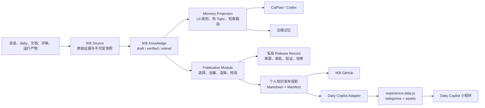

# IKB 记忆治理与个人知识发布方案

> 状态：个人知识准入、两个本地 Adapter 和 51 条存量迁移已落地；自动 release 与撤回待实施
> 日期：2026-07-29
> 范围：IKB、CatPaw/Codex 记忆、云端记忆、Daily Copilot 小程序、GitHub 发布

## 核心判断

IKB 是长期知识的唯一真相源。CatPaw/Codex Memory 只保存高频规则、当前上下文和检索路由；云端记忆负责跨会话检索；Daily Copilot 小程序负责展示已经批准发布的个人知识。四处都可以有内容，但只有 IKB 可以决定一条知识当前是什么、为什么成立、是否仍然有效。

个人知识应该能够提交 GitHub，但能提交的是经过发布门禁的版本，不是包含原始会话、工作证据、人物信息和本机路径的完整 Vault。IKB 在本地保留完整 Knowledge 与证据链，在仓库中保留可公开的个人知识投影；两者通过稳定 ID、版本和内容哈希关联。

小程序代码继续留在独立仓库。知识内容进入 IKB，由 IKB 生成小程序需要的静态数据；小程序只负责分类、阅读、导航和本地学习进度，不再承担知识抽取、去重、验证和敏感性判断。

## 当前状态已经造成双重真相源

IKB 把 personal/work Knowledge、Source、Ledger、迁移清单和 Run 放在被 Git 忽略的 `ikb-data/`。这保证了工作数据和私有证据不会被提交。Publication Core 已能在私有目录构建 Personal GitHub 与 Daily Copilot 两种确定性输出，但还不会自动写入目标仓库；当前对目标仓库的切换仍需在用户授权后执行并独立验证。

Daily Copilot 的 51 条旧经验已作为不可变 Source 快照进入 IKB。迁移结果是 41 个公开 legacy 入口，对应 39 条正式公开 Knowledge；14、15、49 合并为一份保留三份原文的 Harness 手册。另有 10 条包含内部工具、认证或本机环境细节的内容留在本机私有 Vault。7 个缺少独立再发布许可的附件均明确移除，正文保留。

两个确定性问题已经处理：

| 问题 | 当前事实 | 后果 |
|---|---|---|
| 分类契约漂移 | Adapter 生成 8 个分类，页面消费同一注册表 | 数据分类不再因页面硬编码而不可达 |
| 发布边界失效 | 41 条公开入口通过敏感扫描；10 条私有；7 个附件显式移除 | Git 只接收经过门禁的生成投影 |

继续让“记忆整理任务”和“小程序数据文件”分别提炼知识，会产生两个可写来源：一边更新 IKB，一边更新 `experience-data.js`。两边迟早出现内容、分类、验证状态和删除结果不一致。

## 目标架构



### 一个状态一个家

| 对象 | 真相源 | 允许的派生物 |
|---|---|---|
| 原始会话、文档、评论 | `ikb-data/sources/` | Context、Evidence、Candidate |
| 长期知识及其生命周期 | `ikb-data/vaults/<scope>/` | 记忆投影、公开发布投影 |
| 发布选择、来源映射、审批和撤回 | `ikb-data/publications/` | 公开 Manifest 的安全字段 |
| 可提交的个人知识 | `publications/personal/` | 小程序静态数据 |
| 小程序 UI 和学习进度 | Daily Copilot 仓库及用户本机存储 | 不回写 Knowledge |

`publications/personal/` 是只读生成物，不是第二个可编辑 Vault。公开文件被人工修改时，校验应失败；修改要回到对应 Knowledge，再重新构建 Release。

## Git 与隐私边界

`scope` 回答知识属于个人还是工作，`publication` 回答它能否对外。两者不能合并成一个字段，也不能因为 `scope=personal` 就默认允许提交。

| 内容 | 本地 IKB | IKB GitHub | 小程序 GitHub |
|---|---:|---:|---:|
| work Source / Knowledge | 是 | 禁止 | 禁止 |
| personal private Source / Knowledge | 是 | 禁止 | 禁止 |
| personal public Release | 是 | 允许 | 允许生成版本 |
| Source 引用、本机路径、人物身份、审批记录 | 是 | 禁止 | 禁止 |
| IKB 代码、契约、合成样例 | 是 | 允许 | 不适用 |
| 小程序 UI、生成数据、公开附件 | 不适用 | 不适用 | 允许 |

GitHub 仓库按“随时可能公开”设计，不依赖仓库当前是否 private。Git 历史很难彻底删除内容，所以敏感检查必须发生在文件写入受 Git 跟踪目录之前。

工作知识不能直接改标签后发布。确有通用价值时，由 Curator 新建一条 personal synthesis：去掉内部对象、链接、服务名和具体身份，补齐独立适用边界，再经过验证和发布批准。原 work Knowledge 仍留在本地，不发生跨 scope 搬运。

## Publication Module

Publication 是 Knowledge Plane 后面的深模块。调用方只需要声明发布渠道，模块内部完成选择、去敏、格式转换、ID 兼容、附件检查、Manifest 和哈希计算。

目标 Interface 保持两个入口：

```text
ikb publish build --channel personal-github|daily-copilot
ikb publish release <release-id>
```

`build` 只写 `ikb-data/publications/<release-id>/`，不改外部仓库。`release` 必须绑定已通过的 Verifier、Approval、目标仓库和输出哈希，才允许把生成物写入受 Git 跟踪目录；commit 和 push 仍是独立外部动作，不包含在发布命令中。

当前可运行入口有：

```text
ikb publish build --channel personal-github [--knowledge-id <id-or-comma-list>]
ikb publish build --channel daily-copilot --migration-manifest <private-manifest.json>
```

两个入口都会自动创建 Task/Run，并登记 Bundle、Build Record、输出 Manifest、验证报告四个 Artifact；G0/G6、Verifier、`publication.built`、`publication.verified` 和真实 Run Evaluation 均进入 Ledger。`daily-copilot` 额外验证 51 条迁移覆盖、legacy ID 唯一性、分类、附件处置和非公开条目不得引用公开 Knowledge。`publish release` 仍未开放。

两个 Adapter 均已落地：

- Personal GitHub Adapter：已落地，生成 `publications/personal/manifest.json` 和人可读 Markdown。
- Daily Copilot Adapter：已落地，生成 `experience-data.js`、分类注册表和公开 Manifest；附件许可不明时不进入产物。

两个 Adapter 消费同一个版本化 Bundle，不能各自重新筛选或改写知识。当前 `ikb-personal-publication.v1` 的公开字段为：

```yaml
schema_version: ikb-personal-publication.v1
entries:
  - public_id: pub-...
    title: 上下文窗口的经济学
    type: fact
    product_type: fact_card
    summary: ...
    category: 记忆与上下文
    tags: [context, token]
    questions_answered: [...]
    applicability: ...
    boundary: ...
    use_when: ...
    use_inputs: [...]
    use_outputs: [...]
    use_steps: [...]
    use_checks: [...]
    use_stop_conditions: [...]
    valid_from: 2026-07-24
    temporal_state: current
    content_markdown: ...
    content_hash: ...
```

公开 Bundle 不包含 Knowledge ID、`source_refs`、`fact_refs`、Compilation、本机路径、内部 URL、人员标识或 Approval 内容。构建阶段的完整映射只保存在私有 Build Record；批准并真正写入目标后才一次性生成最终 Release Record，不能先登记 Artifact 再原地补字段：

```yaml
release_id: release-...
knowledge_ids: [kb-...]
approval_id: approval-...
verifier_artifact_id: artifact-...
target_repo: daily-copilot-miniprogram
output_hash: sha256:...
```

## 准入和发布是两道门

Knowledge verified 只说明知识有依据，不说明可以公开。发布必须同时满足：

1. `scope=personal`，且 Knowledge 当前不是 retired。
2. 有真实任务验证或用户确认，不能把旧小程序条目直接批量标成 verified。
3. Publication Approval 明确允许目标渠道。
4. 内部域名、服务标识、AppKey、订单号、群 ID、本机路径、认证方式和凭证模式扫描无命中。
5. 附件来源、许可证和再发布权明确；不明确时只发布正文，不打包附件。
6. Markdown、HTML 和附件均通过白名单渲染，分类、ID 和链接完整。
7. 构建结果和待写入文件的 SHA-256 一致。

敏感词扫描只负责亮红灯，不能代替 scope 和来源门禁。Verifier 通过也不能代替 Publication Approval。

## 记忆清理改成 IKB 的派生流程

现有流程先压缩 Memory，再扫描 Topic 形成经验，顺序相反。正确链路是：

```text
Source intake
  → Knowledge admit / merge / retire
  → Memory Projection build
  → Personal Publication build
  → Cloud Projection build
  → 召回与发布验收
  → 最后轮转 daily 和旧缓存
```

每周维护先把 daily、Topic 和 Agent 会话增量导入 Source；Curator 决定 admit、merge、revision 或 skip；Memory Projection 再根据用户硬约束、当前 Task、最近引用和 Knowledge feedback 生成 L0/L1。只有 Source 完整、Knowledge 有目的地、代表性问题能够召回时，旧 daily 才能压缩。

Memory、云端和小程序都不再自行抽取知识。Memory 任务只负责热度和路由，云端同步只负责服务投影，小程序发布只负责公开展示。

## 小程序的迁移方式

小程序仓库继续独立存在。UI、分类页、详情页、附件加载和 `learning_progress` 属于小程序；Knowledge、验证、去敏和发布授权属于 IKB。

现有 51 条按以下步骤迁移：

| 阶段 | 动作 | 验收 |
|---|---|---|
| M1 原文接入 | 已完成：Git commit `3b496f4` 作为 Source 快照 | 51 条原文、分类、附件和 legacy ID 可追溯 |
| M2 知识拆分 | 已完成：39 条公开 Knowledge、10 条私有 Knowledge；三条 Harness 内容合并但保留全文 | 每条都有 Knowledge 或明确的私有处置 |
| M3 发布审查 | 已完成：41 个公开 legacy 入口、10 个私有入口 | 51/51 均有 disposition 和理由 |
| M4 双 Adapter | 已完成本地确定性构建 | JS、分类表和 Manifest 共享内容哈希 |
| M5 兼容切换 | 已完成：公开入口保留 legacy ID；7 个附件显式移除 | 经验阅读进度不错误迁移；学习主题换题时使用新 ID |
| M6 停止双写 | 已完成生成标记和数据契约测试 | 51 条覆盖、正文、分类、敏感扫描和 ID 契约均有回归测试 |

分类注册表也必须由 Bundle 生成，不能继续在页面里手写 5 个分类。迁移完成后，当前 8 个分类均有入口，现有 12 条不可达经验重新可见。

## 实施拆分

本方案是 IKB Core 的跨 Plane 能力，不建新的子项目。

### P0：先封住发布风险

- 冻结 `experience-data.js` 的人工新增。
- 给现有 51 条建立敏感性与附件许可清单。
- 修正“小程序仓库已在 GitHub，所以内容天然可公开”的错误假设。

### P0.5：先落个人知识准入

- 以 `quality_version >= 4` 作为正式个人 Knowledge 的准入版本；旧 personal draft 只保留可读和 advisory 语义。
- 按 `preference / goal / fact / entity / decision / playbook / lesson / synthesis / people` 分流，不再用一套“摘要够不够长”的规则。
- 所有正式个人 Knowledge 必须有来源、准入理由、适用范围、边界、时间状态和消费者问题；不同类型再叠加各自的证据与验证条件。
- `src/knowledge/personal-admission.ts` 是唯一准入实现，`capture/ingest/status/lint` 共用同一检查；不满足条件时不落盘或不能晋升 `verified`。
- 人物观察继续使用更严格的身份、独立 Episode、来源/日期、反证和 `do_not_use_for` 门禁；人物 dossier 不等同于人物 Knowledge。

### P1：建立确定性契约

- 已完成 Publication Bundle、Build Record、Personal GitHub Manifest 和输出哈希。
- 已登记 `publication.built / verified / approved / released / withdrawn` 事件类型；当前 build 会真实产生前两类。
- 已完成 personal、verified、public、用户/任务验证、生命周期、敏感内容和私有 lineage 门禁。
- 已完成私有原子暂存、重复构建字节一致、篡改和符号链接阻断。
- 待完成最终 Release Record、精确 Approval 绑定、目标仓白名单写入与撤回。

### P2：实现两个 Adapter

- Personal GitHub Adapter 已输出人可读 Markdown 和 Manifest。
- Daily Copilot Adapter 已输出兼容数字 ID 的 JS、分类表、公开 Manifest 和附件处置。
- 两个 Adapter 共用 Publication Bundle、公开 ID 和内容哈希；Daily Copilot 的重复构建与覆盖门禁已有回归测试。

### P3：迁移存量并替换维护任务

- 已完成 51 条迁移、去重和发布审查。
- 小程序经验数据已改为 IKB Source → Knowledge → Publication 的只读生成投影。
- 云端记忆改为消费明确 allowlist 的 Memory Projection，不再扫描所有 Topic 猜测覆盖关系。

## 验收条件

方案实施完成需要同时满足：

- IKB 是唯一可写 Knowledge 真相源；小程序和 GitHub 目录均为生成物。
- work 或 personal-private Knowledge 无法构建公开 Release，且有确定性失败测试。
- Git clone 可以直接阅读已发布个人知识，不需要本机 `ikb-data/`。
- 同一 Release 重复构建字节一致；不同 Adapter 的 Manifest 使用同一 entry hash。
- 小程序保留 legacy ID，现有阅读进度不失效；8 个分类全部可达。
- 公开结果不含内部域名、服务标识、身份、路径、凭证模式和私有证据引用。
- 附件没有许可或命中敏感信息时自动阻断，不静默丢弃。
- 发布前有 Verifier 和 Approval，写入后可按 release ID 撤回；commit/push 不被自动执行。
- 记忆轮转前完成 Source、Knowledge 目的地和召回 canary 对账，不再原地覆盖唯一副本。

## 明确不做

- 不把 Daily Copilot UI 搬进 IKB 仓库。
- 不让小程序直接读取 `ikb-data` 或调用本机 IKB。
- 不把 work Knowledge 通过改标签直接发布。
- 不把 `experience-data.js` 继续当作知识编辑入口。
- 不因为 GitHub 仓库是 private 就降低敏感检查。
- `publish build` 不自动 commit、push 或发布小程序；Git 操作仍需单独授权和验证。
