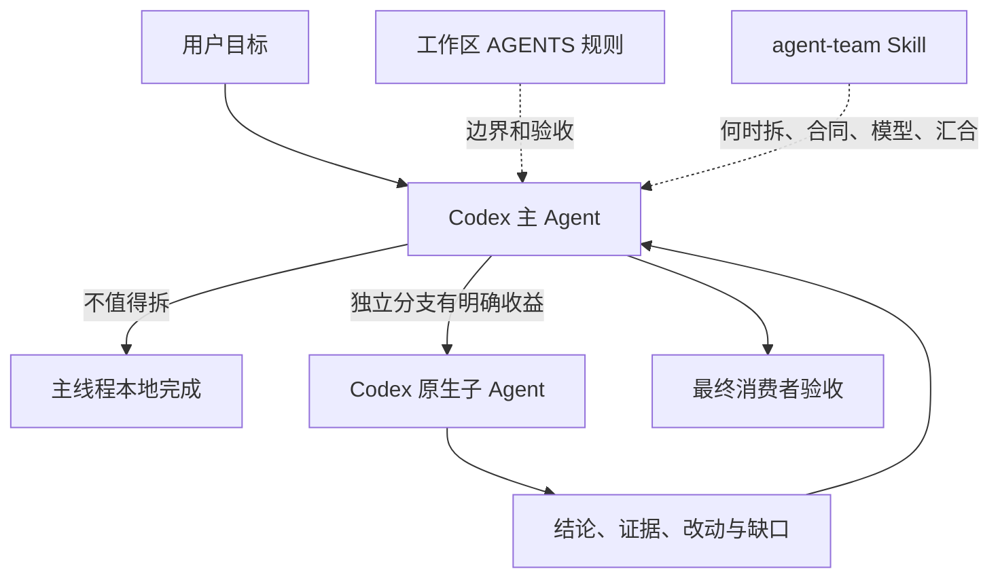
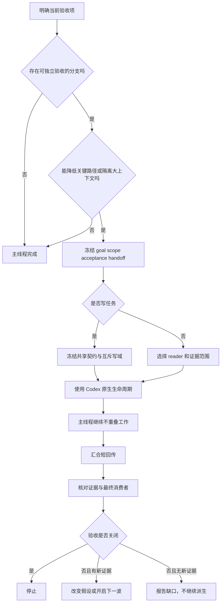

# Codex agent-team 迁移前现状审计

> 本文冻结迁移前事实，不再代表当前安装态。Agent Team 已迁入 IKB，插件和旧入口均已移除；现行方案见 [Agent Team 独立演进方案](evolution-plan.md)。

## 一、结论

现有 agent-team 会产生负向效果，但问题不在“多 Agent 没有价值”，而在治理层同时混入了错误的宿主指令、未经效果验证的模型路由，以及不可复现的本地安装态。Codex 已经提供原生并行和子 Agent 生命周期，agent-team 真正有用的部分是决定什么时候拆、怎么冻结边界、如何汇合和验收；它不应该再实现一套调度 Runtime。

当前决策如下：

| 决策项 | 结论 | 理由 |
|---|---|---|
| 是否整体停用 agent-team | 否 | 条件式委派、Writer Barrier、冻结快照和父级验收仍有实际价值 |
| 是否保持当前完整暴露面 | 否 | 两份源码 Skill 仍指导 Claude 专属工具，Codex 可以自动匹配到它们 |
| 是否默认强制并行 | 否 | 简单任务误委派已有明显耗时损失，任务等级和文件数不能代替经济性判断 |
| 是否恢复生命周期硬 Hook | 否 | 历史上已经阻断过完成所需动作，并出现缺失脚本拖垮无关任务的事故 |
| 是否继续固定使用 Luna 处理多数叶子任务 | 暂不 | 当前只有静态合同测试，没有足够真实质量 A/B |
| 是否扩展 Pi / Dynamic Workflow | 暂缓 | Codex 不缺执行引擎，当前缺口是路由正确率、证据验收和发布可复现性 |

目标形态是 Codex minimal profile：保留 team-delegate、team-feature、team-review 和只读 reviewer；源码策略 Skill 只有经过 Codex 可移植性检查后才暴露。插件保持薄，不维护任务队列、运行账本、心跳、租约或恢复状态机。

## 二、审计范围与证据口径

本次审计回答的是“当前本机 agent-team 是否值得继续启用、会造成什么负向效果、应如何收缩”，不是重新评价所有开源多 Agent 框架，也不证明某个模型在所有任务上更强。

证据分为四层：

| 证据层 | 本次使用内容 | 可以证明什么 | 不能证明什么 |
|---|---|---|---|
| 当前源码 | wshobson-agents 中的 manifest、Skill、命令和适配器 | 当前文本合同、暴露面、路由和边界 | 模型是否一定按文本执行 |
| 当前安装态 | Codex 插件列表、缓存对比、全局软链接、Git 状态 | 新任务会加载什么、本地是否可复现 | 已打开旧任务是否热加载新配置 |
| 确定性测试 | 25 项 Codex/Pi 目标测试 | 生成、关键字段和静态约束没有破坏 | 真实路由正确率、耗时、token 和最终质量 |
| 运行与历史 | 8 月 7 日至 26 日的 A/B、rollout 和 Hook 事故记录 | 已发生故障、真实调用数量和单样本耗时 | 长期收益比例及所有失败的因果归属 |

文档中的判断使用三个状态：

- **已确认现行问题**：当前文件或安装态可以直接复现。
- **已确认历史问题，当前已修复**：曾经真实发生，但当前代码已经移除对应机制。
- **待验证风险**：机制上可能发生，当前没有足够运行证据证明已经造成结果损失。

这个区分很重要。历史事故不能冒充当前故障，静态测试通过也不能冒充真实效果。

## 三、现有 agent-team 到底做了什么

Codex 原生能力已经包含 spawn_agent、followup_task、wait_agent、send_message 和 interrupt_agent。agent-team 不负责执行这些动作，它通过 Skill 和角色说明影响主 Agent 的调度判断。



职责边界应当稳定在下面这张表：

| 组件 | 应负责 | 不应负责 |
|---|---|---|
| Codex Runtime | 子 Agent 创建、并发槽位、消息、等待、终止和模型执行 | 业务范围和最终质量判断 |
| 主 Agent | 目标、范围、关键路径、跨分支仲裁和最终验收 | 重做子 Agent 的全部原始调查 |
| agent-team | 委派经济性、分支合同、写域、冻结快照、汇合格式 | 在线 DAG、任务状态真源、计数式完成门禁 |
| 子 Agent | 一个稳定职责内的读取、实现、测试或审查 | 扩大目标、默认产生外部副作用、接管根级调度 |
| Pi adapter | 在 Pi 宿主上翻译同一组治理原则 | 证明 Codex 端需要另一套 Dynamic Workflow |

因此，agent-team 的价值不是“让 Codex 从不能并行变成可以并行”。Codex 本来就能并行；agent-team 只能提高并行的命中质量和可验收性。如果它不能做到这一点，就只剩额外 prompt、模型调用和协调等待。

## 四、仍然值得保留的能力

### 4.1 条件式委派避免把任务等级当调度规则

当前 team-delegate 要求独立分支能够减少关键路径耗时或主线程上下文压力，L1/L2、仓库数、来源数和文件数本身都不能触发 spawn。简单、紧耦合、无可重叠主线的任务留在本地。这一方向与历史 A/B 一致：调度判断比“有没有开子 Agent”更重要。

### 4.2 分支合同把委派从一句自然语言变成可验收任务

每个分支至少包含 goal、scope、acceptance 和 handoff；写任务再增加 write_scope、forbidden_scope、depends_on 和 produces。这些字段不需要变成新的运行时对象，但能阻止主 Agent把一个横跨多个职责的纵向切片整体交给 worker。

### 4.3 Writer 和 Review Barrier 解决并行写入的真实风险

并行 writer 只有在共享契约冻结、写域互斥后才有意义。Review 也需要冻结同一快照，所有 reader 汇合后才能进入修复轮次。Worktree 只能隔离文件，不能替代接口、状态所有权和最终消费者合同。

### 4.4 父级保留最终验收

子 Agent 的 completed 只表示分支执行结束，不代表业务正确。父 Agent仍要核对证据引用、最小 diff、受影响测试和最终消费者，但不应从头再做一遍相同调查。这个边界能同时降低过度信任和重复工作。

这些能力适合继续保留。它们是治理协议，不依赖第二套 Runtime，也不需要硬 Hook 才能成立。

## 五、现行问题、负向机制与修复方案

### 5.1 Codex 会加载 Claude 专属调度指令

**状态：已确认现行问题，优先级最高。**

Codex manifest 当前把整个 skills 目录作为暴露入口。team-composition-patterns 明确写着 Claude Code Agent Teams，要求使用 Agent 工具、Explore/Plan/general-purpose 类型，并让用户配置 ~/.claude/settings.json 的 tmux、iTerm2 或 in-process 模式。team-communication-protocols 使用 message、broadcast、shutdown_request JSON，调用 ExitPlanMode、TeamDelete，并从 ~/.claude/teams 读取成员。

这些不是术语差异，而是宿主合同错误。Codex 的真实接口是 spawn_agent、send_message、followup_task、interrupt_agent；当前宿主最多有四个并发子分支，而源码 Skill 还会推荐五人团队。模型一旦自动匹配到这两份 Skill，可能尝试不存在的工具、选择错误的 agent type，或者花费额外轮次把 Claude 合同重新翻译成 Codex 合同。

当前测试只检查 team-delegate、team-feature、team-review 三个生成工作流是否包含 Claude 运行时词汇，没有遍历 Codex manifest 实际暴露的全部源码 Skill。问题因此能在 25 项测试全部通过的情况下继续存在。

**方案：**

Codex manifest 不再直接暴露未经验证的整个源码 skills 目录。近期最小方案是排除 team-composition-patterns 和 team-communication-protocols，只保留已经 Codex 化的三个生成工作流和 reviewer。长期方案有两种，选一种即可：把源码 Skill 改成宿主无关的动作描述，由 adapter 生成宿主生命周期；或者为 Codex 维护明确的可暴露白名单。不要依靠模型在运行时自己识别“这一段只适用于 Claude”。

**验收：** 新任务的可用 Skill 清单中不再出现 Claude 专属版本；对 Codex 实际暴露的每一份 Skill 扫描 Agent、TeamDelete、ExitPlanMode、TaskUpdate、SendMessage、~/.claude/teams 等不兼容合同；再跑一条真实的组队和关闭链路，确认只调用 Codex 原生工具。

### 5.2 错误委派会同时增加墙钟、token 和主线程循环

**状态：历史已确认，当前合同已部分缓解。**

历史同题 A/B 中，强制 explorer 用时 107.1 秒、7 次主模型循环、累计主输入 266.6k；隔离 explorer 降到 81.0 秒和 77.6k；主线程本地批量读取只需 27.4 秒、2 次循环、63.4k。这个样本不能推出所有委派都慢，但足以证明“任务稍复杂就 spawn”会产生明显负收益。

负向链路通常是：主 Agent先花一轮规划和启动，子 Agent再读取；主 Agent没有可重叠工作，只能等待；结果回来后又重复扫描或重新验证。原本一次批量读取能完成的任务，被拆成规划、spawn、等待、汇合四段。子 Agent模型更便宜也抵消不了新增轮次。

**方案：**

保留现有经济性预检，但把判断收敛成两个问题：分支是否能独立验收；主线程在它执行时是否有不重叠的有效工作，或者分支是否能隔离一段明显的大上下文。两个问题都是否，就留在本地。多仓、多来源、L2 和文件多只作为线索，不能直接触发委派。

**验收：** 单文件修改、两三个短来源、立即阻塞问题和紧耦合实现默认 0 spawn；多来源调查只有在两条证据流真正独立时才并行。评测同时记录最终正确率、墙钟和总 token，不能只看父线程上下文变小。

### 5.3 硬 Hook 曾把治理故障升级为宿主故障

**状态：已确认历史问题，当前已移除。**

旧版本用读取次数、spawn 次数、wait 次数、输出体积和压缩次数阻断后续动作。完成所需操作达到阈值后，主 Agent不能继续读取、汇合或验证，只能反复换路径或继续委派，最终形成死循环。另一次生产排查中，缓存内 context_guard.py 已不存在，但 hooks.json 仍引用它，PreToolUse 和 Stop Hook 直接阻断所有工具调用；agent-team 的故障因此拖垮了无关的押款问题排查。

当前 Codex manifest 已经移除 agent-team 生命周期 Hook，README 也明确计数和上下文压力只能作为判断信号，不能阻止完成所需动作。这次修复方向正确，应当成为永久边界。

**方案：**

不恢复任何基于读取、spawn、wait、输出大小或压缩次数的硬门禁。需要观测时读取 rollout 事件或离线统计；需要纠偏时由主 Agent在当前语义故障重复出现后换方案。插件故障不能阻断 Codex 的原生生命周期和最终验收。

**验收：** manifest 不注册 agent-team Hook；缺少任何插件脚本时，原生读取、测试、spawn、wait 和最终回复仍可运行；相关测试检查“不存在 Hook”，而不是给 Hook 增加 fail-open 分支后继续保留。

### 5.4 模型路由把成本优化和调度治理绑在了一起

**状态：待验证风险。**

本机 Codex 默认子 Agent 是 Terra medium，当前 team-delegate 却把确定性命令、普通调查和部分复杂调试分别固定到 Luna low、medium、high。只有范围会改变时才转 Terra。这个设计可能节省成本，也可能因主 Agent分类错误，把需要跨模块判断的任务交给较弱模型；子 Agent又被禁止自行升级，只能在错误档位上返回不完整结论。

当前测试验证的是路由文字存在，并没有证明 Luna 在这些任务上的 acceptance、人工纠偏和最终质量不低于 Terra。把它和 agent-team 一起默认启用，会让“并行是否有效”和“降模型是否有效”两个实验互相污染。

**方案：**

近期让普通分支继承宿主默认模型。只有命令确定、输入边界固定、结果可机械验证的任务才显式下调到 Luna；复杂证据、跨模块结论和存在范围歧义的分支使用 Terra，根级仲裁仍留给主 Agent。模型优化单独做 A/B，不把它写成 agent-team 的必选合同。

**验收：** 同一任务分别跑 inherit/Terra 和 Luna，比较最终验收、人工纠偏、总 token 与墙钟；没有代表性结果前，不用静态测试宣称质量等价。

### 5.5 无限波次和无限复用不会死锁，但会积累陈旧上下文

**状态：待验证风险，近期样本已经出现高总量。**

当前合同限制最多四个并发分支，但明确不设置总 spawn 完成门禁，也不限制后代数量和深度；reuse_count 只用于诊断，不影响再次复用。这样可以避免旧版“达到次数后无法完成”的死门禁，但并发上限不能阻止多波串行创建，长期复用也可能携带旧快照、旧假设和已经失效的写域理解。

8 月 24 日至 26 日可见的 18 个根 rollout 中，7 个调用过 spawn，其中 3 个是明确 canary、4 个是普通工作。最高的一个会话出现 24 次 spawn，但它包含 27 条用户指令和多个不同目标，不能据此认定单一任务失控。这组数据只能说明高总量真实可达，不能证明插件已经造成质量损失。

**方案：**

不恢复固定总次数硬门禁，增加语义上的“下一波条件”：上一波结果关闭了什么 acceptance，当前还缺什么，新分支为什么会改变结论。复用也不按纯数字限制，而是检查责任是否仍稳定、仓库或快照是否变化、共享契约是否更新、前次结果是否已经验收。任一语义发生变化，就使用新鲜上下文或留在主线程。

**验收：** 每个新增波次都能对应一个尚未关闭的验收项；同一失败没有新证据时停止继续派生；复用后的分支不得引用已失效快照或旧写域。总 spawn 和 reuse_count 保留为观测指标，不成为完成门禁。

### 5.6 压缩回传降低上下文，也可能放大过度信任

**状态：待验证风险。**

当前 team-delegate 推荐 status、summary、evidence、changes、validation 和 gaps 六字段回传，但 JSON 不是强制格式，也没有现行 Runtime validator。短回传能减少父线程上下文，代价是原始推导被留在子线程；父 Agent如果只读 summary、不检查 evidence 和最终消费者，错误会被压缩成看似确定的结论。

**方案：**

保持回传简短，不恢复 Hook 校验。父级按风险抽验：普通只读结论检查关键证据引用；代码任务检查 diff、受影响测试和写域；跨模块或外部副作用任务穿过真实输入验收到最终消费者。原始日志和大输出放文件，回传只给路径、范围和结论。

**验收：** completed 与 pass 分开；关键结论至少有可定位证据，代码分支至少有变更与验证状态，最终交付不能只引用子 Agent自报完成。

### 5.7 当前测试证明“文本存在”，没有证明“行为正确”

**状态：已确认现行证据缺口。**

本轮目标测试 25 项全部通过，用时 0.78 秒。它们能发现生成失败、字段遗漏、Hook 回归和三份工作流重新出现 Claude 词汇。delegation-routing eval 则读取 9 个案例，只检查案例里的 policy_terms 能否在 Skill 正文找到；测试没有启动新 Codex 任务，也没有判断模型最后选择 spawn 还是 no_spawn。

Pi 测试同样以 JavaScript 语法、schema 和关键字符串为主。当前证据不能回答四个核心问题：简单任务是否误 spawn，复杂任务是否漏 spawn，Luna 是否降低质量，Dynamic Workflow 是否优于 Codex 原生编排。

**方案：**

保留静态测试作为提交门禁，另建行为评测层。行为评测从新任务启动，输入固定，记录实际工具调用、模型路由、最终结果、人工纠偏、墙钟和总 token。静态 contract、真实 runtime、最终消费者分开报告。

**验收：** 每个路由案例都有真实 spawn/no-spawn 结果；评测报告能回到 rollout 或 run id；不能用“25 passed”替代行为结论。

### 5.8 当前安装指向脏工作区，同一版本号覆盖多种行为

**状态：已确认现行工程风险。**

Codex 当前安装并启用了 agent-teams 1.3.1，路径直接指向 /Users/htwu/projects/wshobson-agents/plugins/agent-teams。仓库 main 比 origin/main ahead 1，agent-team 相关还有 28 个文件、约 612 行新增和 466 行删除未提交；全局三个工作流和 reviewer 又软链接到被 Git 忽略的 .codex 生成目录。

当前缓存与源码 diff 为 0，没有发现实际漂移。风险在下一次修改：新任务会从活跃工作区和缓存加载内容，但版本仍显示 1.3.1；出现问题时难以回答“这个任务加载的是哪一版”，回滚也缺少干净基线。

**方案：**

先收敛当前变更，形成干净 commit 和唯一版本号，再生成、安装并用新任务验收。生成目录可以继续忽略，但必须能从提交版本确定性重建；全局软链接只指向与发布版本一致的生成物。实验变更不要覆盖已安装稳定版本，可使用独立 worktree 或明确的预发布版本。

**验收：** Git 工作区干净；HEAD 包含本次业务文件；生成物可重复；缓存与源码一致；插件列表显示的新版本与 commit 对应；必须由安装后的新任务证明配置生效。

### 5.9 源码 Skill 与生成工作流重叠，增加触发冲突和上下文成本

**状态：已确认暴露面重叠，运行影响待验证。**

当前 Codex 一边通过 marketplace 暴露六份源码 Skill，一边通过全局软链接暴露 team-delegate、team-feature 和 team-review。task-coordination-strategies 与 team-delegate、parallel-feature-development 与 team-feature、multi-reviewer-patterns 与 team-review 语义明显重叠；全部正文合计约 100 KB，虽然不会每次全部注入，但自动触发时可能加载两套相似说明。

重叠不一定造成故障，但会增加选择歧义：一份是策略说明，一份是执行工作流；两份的模型路由、复用和停止条件只要演进不同步，就会给主 Agent相互冲突的建议。

**方案：**

Codex 只保留一个公开入口层。生成工作流负责可执行流程，深层策略作为它的 references 按需读取；不要让同一语义同时以两个可自动触发 Skill 出现。Claude、Codex 和 Pi 可以共享内容源，但各宿主的可发现入口必须明确。

**验收：** 新任务的 Skill 列表中，每种工作流只有一个主要入口；相同合同只维护一份正文；adapter 生成后检查入口名称、描述和 references 链路。

### 5.10 Pi / Dynamic Workflow 目前是扩展面，不是 Codex 缺口

**状态：代码已存在，价值待验证。**

当前分支已经加入 pi-dynamic-workflows adapter，提供 explore、feature 和 review 预设。它对没有 Codex 原生子 Agent生命周期的 Pi 宿主有意义，但不能反向证明 Codex 也需要相同 workflow runtime。Codex 已有创建、等待、通信和中断能力，再叠一层固定 DAG 会增加 schema、adapter、版本和调试面。

**方案：**

把 Pi adapter 视为独立宿主适配，不进入 Codex 默认路径。Codex 端先证明 minimal profile 的路由质量；只有同一确定性顺序在真实任务中多次失败，且失败来自 prompt 无法稳定执行，而不是边界或验收不清，才考虑把那一个流程落成代码。

**验收：** Pi 的价值由 Pi 真实最终消费者验证；Codex 的价值由 Codex A/B 验证，两者不互相代替。没有运行证据前，不以 adapter 代码和静态测试宣称 Dynamic Workflow 已带来能力提升。

## 六、目标方案

### 6.1 Codex minimal profile

目标暴露面只有四个入口：

| 入口 | 作用 | 默认模型策略 |
|---|---|---|
| team-delegate | 判断是否委派，冻结 reader/worker 合同，汇合证据 | inherit；确定性叶子可单独下调 |
| team-feature | 共享契约冻结、写域互斥、集成验收 | 普通实现 inherit，歧义分支 Terra |
| team-review | 冻结快照、并行只读审查、统一去重后修复 | reviewer 使用稳定固定模型 |
| team-reviewer | 只读审查角色 | Terra medium，除非评测证明其他档位等价 |

parallel-debugging、task-coordination 等策略不需要消失，可以成为上述入口的 references。team-composition 和 team-communication 要么改成宿主无关内容，要么仅在 Claude 安装面出现。

### 6.2 统一调度流程



该流程没有总次数硬门禁。真正的停止条件是验收已关闭，或同一语义失败在没有新证据时再次出现。

### 6.3 配置与实现边界

- 宿主生命周期只使用 Codex 原生工具。
- 模型选择默认继承本机配置，显式降档属于独立成本优化。
- 并发槽位由宿主控制，Skill 只决定哪些分支值得占用。
- 分支登记放在当前主 Agent计划中，不新增持久化 ledger。
- Handoff 使用短结构，但格式错误不阻断 Runtime；父级负责风险匹配的验收。
- 观测来自 rollout 和离线统计，不注入完成门禁。
- 插件、模型和 Skill 修改只以新任务作为生效样本。

## 七、实施顺序

### 阶段 A：先消除确定性负向面

改造对象是 Codex 的 Skill 暴露和发布入口。移除两份 Claude 专属 Skill 的 Codex 暴露，合并重叠入口；现有三份生成工作流和 reviewer 保持可用。补一项 manifest 全量扫描测试，检查每份实际暴露 Skill，而不是只检查三个命令生成物。

完成标准：新任务看不到错误入口，不会收到 Claude 生命周期指令；25 项原有目标测试继续通过，新增暴露面测试通过。

### 阶段 B：拆开调度实验和模型实验

team-delegate 的普通分支先 inherit，本阶段不同时验证“是否该委派”和“是否该用 Luna”。确定性叶子保留显式低成本 route，但必须有机械验收；其他任务的模型优化进入独立实验组。

完成标准：同一输入可以只切换 agent-team，而不改变模型；也可以只切换模型，而不改变调度合同。

### 阶段 C：建立真实行为 A/B

从新 Codex 任务启动，跑本地简单任务、独立多来源、竞争假设、互斥写域和冻结快照 review。先积累 20 个真实样本观察误伤，再对核心场景做同题多次 A/B。每次报告最终结果、人工纠偏、墙钟、总 token、spawn 和 wait，不把单次最好结果当推广依据。

完成标准：简单任务稳定不误 spawn；目标并行场景的最终正确率不低于基线；如果墙钟或 token 没有改善，必须能说明带来了什么质量收益。

### 阶段 D：形成干净版本并重新安装

前三阶段的合同和测试收口后，提交源码、生成适配产物、升版本并安装。安装完成后新建 canary，核对插件路径、Skill 列表、模型、实际工具调用和最终 handoff。

完成标准：源码、commit、版本、缓存和新任务运行证据一一对应；旧任务不进入新版本验收。

### 阶段 E：按重复故障信号决定是否扩展

只有出现两类信号才继续扩展：同一确定性流程在多个真实任务中重复跑错顺序；或者同一宿主适配问题反复要求人工翻译。扩展对象应是那一个稳定流程，不是通用调度 Runtime。

完成标准：扩展前写清失败样本、现有责任方为什么无法修复、代码化后由哪个最终消费者验证。没有这些证据，Pi/Dynamic Workflow 保持独立试验态。

### 预计改动面与责任边界

后续实施应从暴露面和源码可移植性开始，不先改 Runtime。具体文件范围如下：

| 改动面 | 目标 | 边界 |
|---|---|---|
| plugins/agent-teams/skills/team-composition-patterns | 去掉 Claude 专属 agent type、Agent 工具和 display mode 指令，改成宿主无关的职责与团队规模判断 | Claude 的 tmux、iTerm2 配置移入 Claude 专属说明，不进入共享 Skill 主体 |
| plugins/agent-teams/skills/team-communication-protocols | 把 message、shutdown 和 plan approval 改成动作语义，由宿主映射真实工具 | 不在共享正文固定 TeamDelete、ExitPlanMode 或 ~/.claude/teams |
| plugins/agent-teams/commands/team-delegate.md 及对应策略 Skill | 普通分支改为继承宿主模型；增加语义下一波和复用新鲜度判断 | 不增加固定总次数、深度和 reuse 硬门禁 |
| plugins/agent-teams/.codex-plugin 与 Codex adapter | 让 Codex 只发现明确兼容的入口，消除源码 Skill 与生成工作流的重复触发 | manifest 能否直接表达白名单需要在实施前核对当前官方合同；未知时不猜字段 |
| tools/tests/test_agent_teams_codex.py | 遍历实际暴露面检查宿主词汇，增加真实路由评测入口 | 静态测试继续快跑，不冒充 runtime A/B |
| marketplace、版本和生成物 | 干净提交后统一升版、生成、安装和新任务验收 | 不用脏工作区覆盖同一 1.3.1 版本 |

team-feature、team-review 和 Pi adapter 不在第一批重构范围内，除非暴露面调整导致直接回归。这样可以先修当前确定错误，再用行为数据决定模型、复用和 Dynamic Workflow 是否需要继续变化。

## 八、真实评测设计

### 8.1 实验组

| 组别 | 配置 | 用途 |
|---|---|---|
| A：原生基线 | Codex 原生能力 + 工作区 AGENTS，不加载 agent-team 工作流 | 测量没有额外治理的真实表现 |
| B：minimal profile | A + 三个工作流和 reviewer，模型保持 inherit | 单独测量调度治理收益 |
| C：模型优化 | 与 B 相同，只对确定性叶子切换 Luna | 单独测量模型降档收益和质量代价 |
| D：Dynamic Workflow | 仅在 Pi 或明确需要固定流程的独立实验中使用 | 不与 Codex minimal profile 混算 |

### 8.2 场景集

| 场景 | 预期行为 | 主要观察点 |
|---|---|---|
| 单文件或短来源 | 0 spawn | 是否误委派，墙钟和总 token |
| 两条独立证据流 | 1 至 2 个 reader | 是否真实并行，父线程是否重复读取 |
| 竞争假设调试 | 按互斥假设拆 reader | 能否定位首个语义错误，是否只堆相同证据 |
| 冻结契约后的互斥写域 | 并行 writer + 父级集成 | 文件冲突、合同漂移和最终测试 |
| 同快照多维 review | 并行只读 + 汇合后修复 | 重复 finding、漏报、修复前写入 |

### 8.3 指标和判定

质量是硬前提。最终消费者不通过、出现越权写入、错误宿主工具或共享写域冲突时，耗时再低也不算收益。

| 指标 | 口径 |
|---|---|
| 最终验收 | 真实输入是否到达预定消费者，测试、运行和自报状态分开 |
| 人工纠偏 | 用户或主 Agent因范围、工具、事实和结果错误产生的纠偏次数 |
| 墙钟 | task_started 到 task_complete；Agent 等待和外部等待分开 |
| 总 token | 主线程与所有子线程合计，不能只看父上下文 |
| 调度 | spawn、reuse、wait、interrupt 的实际调用与成功状态 |
| 上下文重复 | 父线程是否重复子 Agent已完成的原始扫描或实现 |
| 稳定性 | 无效工具调用、写域冲突、陈旧快照和无法复现的安装差异 |

推广判断不预设一个脱离基线的百分比。先要求最终正确率和人工纠偏不劣化，再观察目标场景的 p50/p90 墙钟和总 token。某一类场景没有收益，就只关闭该类自动触发，不把整套插件一起判定成功或失败。

## 九、不做什么

- 不开发新的通用 DAG、任务队列、心跳、租约、重试和恢复系统。
- 不恢复基于工具次数和上下文大小的 Hook 拒绝逻辑。
- 不因潜在风险新增指纹、metadata、状态机或硬预算。
- 不把 L1/L2、多仓、多文件直接等同于必须委派。
- 不用子 Agent completed、静态测试通过或本地生成成功代替最终消费者验收。
- 不在同一实验中同时改变路由、模型、Skill 内容和 Runtime。
- 不把 Pi adapter 的存在当成 Codex 需要 Dynamic Workflow 的证据。

## 十、当前证据快照

### 10.1 2026-08-26 本机状态

| 检查 | 结果 |
|---|---|
| Codex 插件 | agent-teams@claude-code-workflows 1.3.1，installed、enabled |
| 安装路径 | /Users/htwu/projects/wshobson-agents/plugins/agent-teams |
| Git | main 比 origin/main ahead 1；工作区有大量未提交 agent-team 变更 |
| 缓存一致性 | 缓存 skills、manifest 与当前源码 diff 为 0 |
| 全局入口 | 三个生成工作流和 reviewer 软链接到仓库 .codex 目录 |
| 目标测试 | 25 passed in 0.78s |
| Hook | 当前 Codex manifest 未注册 agent-team 生命周期 Hook |

目标测试命令：

```bash
cd /Users/htwu/projects/wshobson-agents
PYTHONDONTWRITEBYTECODE=1 uv run pytest -p no:cacheprovider -q \
  tools/tests/test_agent_teams_codex.py \
  plugins/agent-teams/adapters/pi/tests/test_pi_adapter.py
```

### 10.2 近期运行样本

8 月 24 日至 26 日可见的 18 个根 rollout 中，7 个出现 spawn_agent 调用；其中 3 个是显式 Agent Teams canary，4 个是业务或工程任务。最高的 24 次调用来自一个包含 27 条用户指令、多个不同目标的长会话。当前没有证据表明 agent-team 会让所有任务自动并行，也没有足够证据把该长会话的全部成本归因于插件。

历史 A/B 只有单题样本，能证明错误委派可能更慢，不能给出长期提速比例。旧设计要求核心场景至少多次同题对照，这一证据仍未补齐。

## 十一、已知未知

- 两份 Claude 专属 Skill 当前确实暴露给 Codex，但近期 rollout 是否已经因它们产生无效调用，未知。
- Luna 路由是否降低最终质量，未知；现有测试只证明路由文本存在。
- 24 次 spawn 会话中多少是必要委派、多少可以复用或留在主线程，未知；会话包含多个连续目标，不能按单任务统计。
- minimal profile 对真实代码任务的长期 p50/p90、总 token 和人工纠偏影响，未知。
- Pi adapter 当前静态合同通过，但 Pi 真实最终消费者是否优于直接工作流，未知。

这些未知不需要靠增加规则来猜。按第八章的实验分开验证，结果改变方案时再演进。

## 十二、证据索引

- [Codex plugin manifest](/Users/htwu/projects/_personal/ikb/projects/agent-team/plugins/agent-teams/.codex-plugin/plugin.json)
- [agent-team README 与原生生命周期边界](/Users/htwu/projects/_personal/ikb/projects/agent-team/plugins/agent-teams/README.md)
- [team-delegate 当前合同](/Users/htwu/projects/_personal/ikb/projects/agent-team/plugins/agent-teams/commands/team-delegate.md)
- [Claude 专属 team composition](/Users/htwu/projects/_personal/ikb/projects/agent-team/plugins/agent-teams/skills/team-composition-patterns/SKILL.md)
- [Claude 专属 communication protocol](/Users/htwu/projects/_personal/ikb/projects/agent-team/plugins/agent-teams/skills/team-communication-protocols/SKILL.md)
- [Codex 目标测试](/Users/htwu/projects/_personal/ikb/projects/agent-team/tools/tests/test_agent_teams_codex.py)
- [旧版治理设计及单题 A/B](/Users/htwu/projects/_workspace-misc/docs/agent/codex-main-subagent-governance-design.md)
- [历史 Hook 死循环修复记录](/Users/htwu/.catpaw/memory/archive/agent-spawn-contract-superseded-20260825.md)
- [缺失 context_guard.py 阻断业务排查记录](/Users/htwu/.codex/memories/rollout_summaries/2026-08-24T09-36-24-sf1k-datamining_610_647_pledge_npe_root_cause.md)
