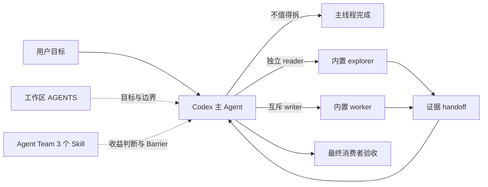

# Codex Agent Team 2.0 演进方案

## 一句话结论

Agent Team 值得作为受控实验安装，但只做一层薄治理：让 Codex 少做不划算的 spawn，并把真正需要并行的 reader、writer 和 reviewer 放进清晰合同。它不替代 Codex 原生 Runtime，也没有证据证明并行任务会普遍提速。

## 当前边界

| 项目 | 决策 |
|---|---|
| 唯一源码 | `/Users/htwu/projects/ikb/projects/agent-team` |
| Codex 执行面 | 原生 `spawn_agent`、`followup_task`、`send_message`、`wait_agent`、`interrupt_agent` |
| Codex 公开入口 | `agent-team-delegate`、`agent-team-feature`、`agent-team-review` |
| 自定义 Agent | 不打包；reader 使用内置 `explorer`，writer 使用内置 `worker` |
| 模型 | 普通分支继承父任务，不固定 Terra/Luna 或 effort |
| 上下文 | 独立分支默认 `fork_turns: "none"`，只传完整 Task Request |
| Hook | 不注册生命周期 Hook，不按次数阻断读取、spawn、wait 或完成 |
| Dynamic Workflow | 暂不进入 Codex 默认路径，只在重复确定性故障被真实样本证明后再评估 |
| Pi | 独立实验，不反向决定 Codex 架构 |

原 `wshobson-agents` 已归档到 `/Users/htwu/Archives/agent-team/wshobson-agents-20260826.tar.gz`。全局 `agent-spawn-contract` 已移除；SpecX 自己消费的同名资源保留，因为它属于另一个明确消费者。

## 为什么不是“增强并行”

Codex 0.149.1 已经具备原生子 Agent。A/B 中，即使不加载 Agent Team，较大的双流审计也会自动启动两个子 Agent，并正确汇合主要结果。因此，重新实现 Runtime、DAG、队列、心跳或租约不会扩展 Codex 的基本能力，只会增加第二份状态。

真实缺口在判断和边界：

- 两个只有一条规则的短文件，原生基线也启动了两个子 Agent。
- writer 如果共享文件或状态所有者未冻结，提前并行会制造冲突。
- reviewer 如果不绑定同一快照，结论不可比较；第一个 finding 到达时就修复会让后续 reader 审查过期对象。
- `wait_agent` 收到进度消息也会返回，返回本身不等于子 Agent 已完成。
- 默认全量继承父会话会放大上下文成本，独立分支应接收最小完整合同。

Agent Team 的价值就是修这几个窄问题。

## 目标架构



源码和发布链路：

```text
plugins/agent-teams/adapters/codex/
    ↓ deterministic build
dist/codex-marketplace/plugins/agent-teams/
    ↓ plugin validation + behavior A/B
agent-teams@ikb-agent-team 2.0.0
    ↓ brand-new persisted task
runtime canary
```

活跃源码目录没有 `.codex-plugin/plugin.json`，不能被误当作安装源。候选包才有 manifest，并且物理上只有三个批准 Skill。

## 三个入口的职责

### delegate

只有“可以独立验收”和“能减少关键路径或主上下文压力”同时成立，才 spawn。任务等级、仓库数、文件数、多来源标签都不能单独触发。

每个分支至少包含：

```text
goal
scope
acceptance
handoff
```

writer 额外包含 `write_scope`、`forbidden_scope`、`depends_on` 和 `produces`。主 Agent 保留根目标、关键路径、跨分支仲裁和最终验收。

### feature

Writer Barrier 只在以下条件全部成立时打开：共享契约已冻结；每个共享文件和状态只有一个 owner；写域互斥；依赖输入已存在；最终消费者和集成检查已知。任一条件不满足就串行执行。

worker 不 commit、push、deploy 或产生未授权外部副作用。主 Agent 检查 diff、写域和受影响测试，再通过最终消费者验收。

### review

所有 reviewer 绑定同一 commit、diff、hash 或工作树快照，并收到相同 blocking criteria。reviewer 只读；全部 reader join 后，才由一个 owner 合并修复。`status=completed` 和 `verdict=pass` 分开报告。

进度 `MESSAGE` 不是 handoff。只有 `FINAL_ANSWER` 或明确 completed 才关闭一个 review dimension。

## 包结构

2.0.0 候选包共六个文件：

```text
.agents/plugins/marketplace.json
plugins/agent-teams/
├── .codex-plugin/plugin.json
├── LICENSE
└── skills/
    ├── agent-team-delegate/SKILL.md
    ├── agent-team-feature/SKILL.md
    └── agent-team-review/SKILL.md
```

不包含：

- 上游 Claude `commands/`、`agents/` 和六个策略 Skill；
- 自定义 reviewer TOML；
- 固定模型和 reasoning effort；
- Hook、MCP、全局软链接；
- Pi workflow 或 Dynamic Workflow Runtime。

因此安装后只有一个 Codex 入口层，不再出现“源码 Skill + 生成 Skill + 全局链接”三套发现路径。

## 验证结果

### 确定性验证

- `make test`：22 passed。
- `make validate-codex`：6 files，0 warning，0 error。
- Codex 插件本地校验器：通过。
- 隔离 `CODEX_HOME`：CLI 能注册 marketplace，并把 `agent-teams@ikb-agent-team` 2.0.0 安装为只含三个 Skill 的缓存包。
- 默认 Codex 已安装 2.0.0；从只读发布快照重装后的全新任务 `01a03d4d-07bb-7451-b798-5cd6b1675e07` 只发现三个入口，单文件路径为 0 collaboration 调用。

### 行为验证

详见 [2026-08-26 Codex A/B](evals/2026-08-26-codex-ab.md)。当前样本说明：

- 简单读取：候选 0 spawn，与基线一致。
- 两个短来源：候选 0 spawn，基线误拆两个子 Agent；候选总 token 约减少 84%，墙钟约减少 50%。
- 真正独立双流审计：两组都启动两个子 Agent并达到 gold；候选没有性能优势。
- `codex exec --ephemeral` 不能作为多 Agent canary，原生 spawn 会因 thread 未登记失败。

这足以证明候选没有把所有任务团队化，并在一个典型 false-positive 场景中有明显收益；不足以证明长期提速。

## 发布与回滚

先从源码生成 `dist/codex-marketplace`，校验后复制到带版本和 hash 的只读发布快照；默认 Codex 只注册这个固定快照，不指向活跃源码或可重建 `dist/`。记录源码 commit、候选包 hash、CLI 安装路径和新任务 thread id。

安装后用全新持久任务验证：

1. 实际 Skill 清单只有三个入口。
2. 小任务不 spawn。
3. 独立分支使用内置角色、模型继承和最小 Task Request。
4. handoff 到达后，主 Agent完成最终消费者验收。

回滚只移除插件和 marketplace：

```bash
codex plugin remove agent-teams@ikb-agent-team --json
codex plugin marketplace remove ikb-agent-team --json
```

IKB 源码和历史评测不删除。

## 后续演进

先积累真实任务，不继续扩功能。每个样本记录最终质量、人工纠偏、墙钟、主子线程总 token、spawn/wait/interrupt、父子重复读取、writer 冲突和 review 快照漂移。

只有出现以下重复信号才改：

- false-positive spawn 重复出现：收紧触发描述或补 no-spawn eval。
- 应拆未拆重复出现：补独立性和收益的正例，不按任务等级强制。
- 父子重复工作重复出现：收紧 handoff 和 join 语义。
- writer 冲突或 reviewer 漂移：修对应 Barrier，不加通用 Runtime。
- 同一确定性步骤多次被 Prompt 执行错：再评估把那一小段落成代码。

Dynamic Workflow 只有最后一种情况成立时才有价值。它不会因为“看起来更完整”进入默认方案。
